# 인스톨러 TUI 배포 가이드

이 문서는 터미널 UI(TUI) 인스톨러 `./install.sh` 로 플랫폼의 **기반 배포**를 끝내는 방법을
화면 순서대로 설명합니다. 기반 배포가 끝나면 로그인, Harness 에이전트, Registry, Gateway 툴,
Knowledge Base, Insights 를 바로 사용할 수 있습니다. 각 단계가 뒤에서 어떤 AWS 리소스를
만드는지, 그리고 인스톨러 없이 같은 작업을 손으로 하는 명령은
[`DEPLOYMENT.md`](../DEPLOYMENT.md) 에 정리되어 있으니 필요할 때 함께 참고하세요.

인스톨러의 가장 큰 특징은 진행 상태를 따로 저장하지 않는다는 점입니다. 화면을 열 때마다
AWS 와 로컬 파일을 실제로 조회해서 "이 단계는 이미 끝났는가" 를 그 자리에서 판정합니다.
그래서 CLI 로 중간까지 진행해 둔 환경에서 이어서 쓸 수도 있고, 작업 도중에 종료했다가 다시
열어도 끊긴 자리에서 그대로 계속할 수 있습니다.

---

## 1. 시작하기 전에

인스톨러를 실행하는 PC 에는 다음이 준비되어 있어야 합니다.

| 항목 | 확인 방법 |
| --- | --- |
| Python 3.13 | `python3.13 --version`. 실행 파일 이름이 다르면 `PYTHON_BIN=python3 ./install.sh` 처럼 지정합니다 |
| Terraform 1.5 이상, AWS CLI v2, Docker | 인스톨러의 첫 단계가 세 도구의 존재를 자동으로 검사합니다 |
| AWS 자격 증명 | `aws sts get-caller-identity` 가 배포할 계정을 돌려주는지 확인합니다 |
| 리전 | 기본값은 `ap-northeast-1`(도쿄)입니다. 바꾸려면 설정 화면 Advanced 탭에서 `region` 과 `azs` 를 함께 수정합니다 |
| Bedrock 모델 접근 | Amazon Bedrock 콘솔의 Model access 에서 Anthropic Claude 모델을 켜 둡니다 |
| 터미널 | TUI 이므로 실제 터미널에서 실행해야 합니다. 파이프나 CI 에서 실행하면 안내 문구와 함께 종료 코드 2 로 끝납니다 |
| 서비스 할당량 | 배포하는 리전에 VPC 1개, NAT 게이트웨이용 Elastic IP 1개가 더 필요합니다. 기본 한도는 리전당 VPC 5개, Elastic IP 5개입니다 |

자격 증명은 관리자 수준이어야 합니다. 배포 과정에서 IAM 역할, VPC, ECS, Cognito, AgentCore
리소스를 모두 만들기 때문입니다. Docker 는 `linux/amd64` 이미지를 빌드할 수 있으면 되고,
Apple Silicon 에서도 인스톨러가 플랫폼 플래그를 자동으로 붙이므로 별도 설정은 필요 없습니다.

할당량은 1차 apply 가 NAT 게이트웨이를 만드는 시점에야 드러나므로 미리 확인해 두는 편이
좋습니다. Elastic IP 가 이미 5개라면 Service Quotas 에서 한도를 올려 둡니다. 보통 몇 분 안에
승인됩니다.

```bash
aws ec2 describe-addresses --region ap-northeast-1 --query 'length(Addresses)'
aws service-quotas request-service-quota-increase --region ap-northeast-1 \
  --service-code ec2 --quota-code L-0263D0A3 --desired-value 10
```

---

## 2. 실행하기

저장소 루트에서 다음과 같이 실행합니다.

```bash
./install.sh                    # 배포 TUI
./install.sh --dry-run          # 명령을 실행하지 않고 조립된 커맨드만 보여줌
```

처음 실행하면 `installer/.venv` 에 가상 환경을 만들고 의존성(Textual)을 설치합니다. 시스템
Python 은 건드리지 않으며, 이후 `installer/requirements.txt` 가 바뀌면 다음 실행에서 자동으로
다시 설치합니다.

배포 대상은 `infra/envs/standalone` 하나입니다. Terraform state 는 S3 백엔드에 두고, 버킷
이름에 들어가는 계정 ID 는 git 이 추적하지 않는 `backend.hcl` 에 기록합니다.

---

## 3. 화면 구성과 키

인스톨러를 실행하면 아래와 같은 **대시보드**가 나타납니다. 위쪽 표가 진행해야 할 단계
목록이고, 아래 패널은 현재 선택한 단계가 실행할 명령과 상태 판정의 근거를 보여 줍니다. 처음
몇 초에서 수십 초 동안은 상태 열이 `확인 중` 으로 표시되는데, AWS 를 실제로 조회하는 중이라는
뜻입니다. 화면 맨 아래 줄에는 현재 화면에서 쓸 수 있는 키가 표시됩니다.

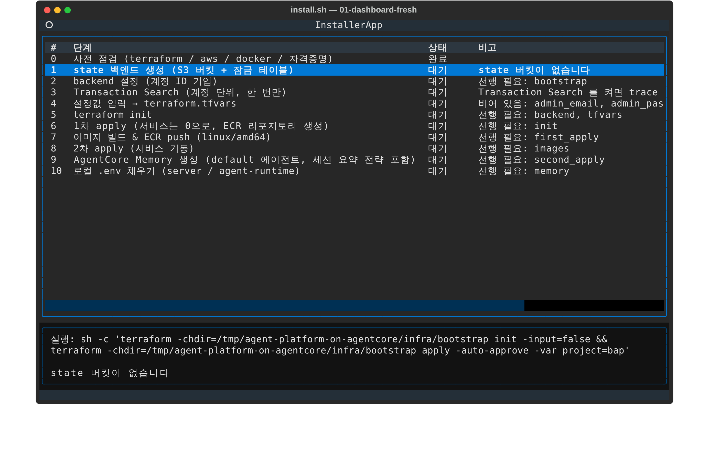

화면 조작에 쓰는 키는 다음과 같습니다.

| 키 | 동작 |
| --- | --- |
| `↑` `↓` | 단계 선택 |
| `Enter` | 선택한 단계 실행. 로그 화면으로 전환됩니다 |
| `r` | 모든 단계의 상태를 다시 점검 |
| `s` | 설정 화면 (Terraform 변수 입력) |
| `o` | 운영 화면 (재배포, 로그, park, destroy) |
| `Esc` | 이전 화면으로 돌아가기. 확인 창에서는 취소 |
| `Tab` `Shift+Tab` | 설정 화면에서 다음·이전 입력란으로 이동. 입력란에 들어가면 값 전체가 선택되므로 바로 타이핑하면 기존 값이 교체됩니다 |
| 마우스 클릭 | 설정 화면의 Required / Advanced / Derived 탭 전환, 입력란 선택 |
| `Ctrl+S` | 설정 화면에서 저장 |
| `Ctrl+C` | 로그 화면과 운영 화면에서 실행 중인 명령 취소 |
| `q` `Ctrl+Q` | 종료. 명령이 실행 중이면 종료하지 않고 그 명령을 취소합니다 |

**상태** 열에는 세 가지 값이 나타납니다.

| 표시 | 뜻 | 할 일 |
| --- | --- | --- |
| `완료` | 리소스나 파일이 실제로 존재함 | 없습니다. 필요하면 다시 실행해도 됩니다 |
| `대기` | 아직 없음이 확인됨 | `Enter` 로 실행합니다 |
| `판정불가` | 자격 증명 만료, 권한 부족, 네트워크 오류 등으로 확인 자체가 실패함 | 비고에 적힌 원인을 해결한 뒤 `r` 로 재점검합니다 |

비고 열에 `선행 필요: …` 가 보이면, 거기 적힌 단계들이 `완료` 가 되기 전까지는 `Enter` 를
눌러도 실행되지 않습니다. `판정불가` 상태는 선행 조건으로 인정되지 않는데, 이미 끝났을지도
모르는 작업을 다시 돌리거나 아직 안 끝난 작업을 건너뛰는 일을 모두 막기 위한 것입니다.

단계는 한 번에 하나만 실행됩니다. 실행 중에 다른 단계를 고르면 "다른 단계가 실행 중" 이라는
안내가 나옵니다.

---

## 4. 단계별 진행

기본적으로는 위에서 아래로 `Enter` 를 눌러 가면 됩니다. 다만 **4번(설정값 입력)은 가장 먼저
저장해 두는 것이 좋습니다.** 1번 단계가 만드는 state 버킷 이름에 `project` 값이 들어가고,
이후 모든 명령과 상태 점검이 `terraform.tfvars` 에 적힌 `project` 와 `region` 을 기준으로
움직이기 때문입니다. 0~4번은 서로 선행 관계가 없어 순서를 바꿔도 됩니다.
같은 계정에 이미 `bap-*` 리소스가 있다면(IAM 역할 이름은 리전과 무관하게 계정 전체에서
겹칩니다) 설정 화면에서 `project` 를 다른 값으로 바꾼 뒤 1번부터 진행하세요. 아래에서는 각
단계가 무엇을 하고 어떤 점을 알아 두면 좋은지 설명합니다.

### 0. 사전 점검

`terraform`, `aws`, `docker` 가 PATH 에 있는지, 그리고 `sts get-caller-identity` 가 성공하는지
확인하는 단계입니다. 따로 실행하는 명령은 없으며 `Enter` 는 재점검과 같습니다. 이 단계가
`대기` 라면 비고에 빠진 도구나 자격 증명 오류가 적혀 있습니다.

### 1. state 백엔드 생성

`infra/bootstrap` 을 apply 해서 Terraform state 를 담을 S3 버킷
`<project>-tfstate-<account-id>` 와 잠금용 DynamoDB 테이블 `<project>-tflock` 을 만듭니다.
설정 화면에서 `project` 를 바꿨다면 그 값이 그대로 이름에 반영되므로, 바꿀 계획이라면 이
단계보다 먼저 설정을 저장해야 합니다. 계정마다 한 번만 필요하고, 이미 있으면 처음부터
`완료` 로 표시됩니다.

### 2. backend 설정

현재 자격 증명의 계정 ID 를 조회해 `infra/envs/standalone/backend.hcl` 을 작성합니다. 버킷
이름에 계정 ID 가 들어가므로 이 파일은 gitignore 대상이며 커밋되지 않습니다.

### 3. Transaction Search (직접 실행)

Insights 의 Trace 패널은 CloudWatch Logs 에서 스팬을 읽는데, AgentCore 는 계정·리전 단위로
Transaction Search 가 켜져 있어야 스팬을 내보냅니다. 이 설정은 샘플링 비율이 과금에 직접
연결되는 결정이라 **인스톨러가 대신 실행하지 않습니다.** 단계를 선택하면 아래 패널에 실행할
명령이 표시됩니다.

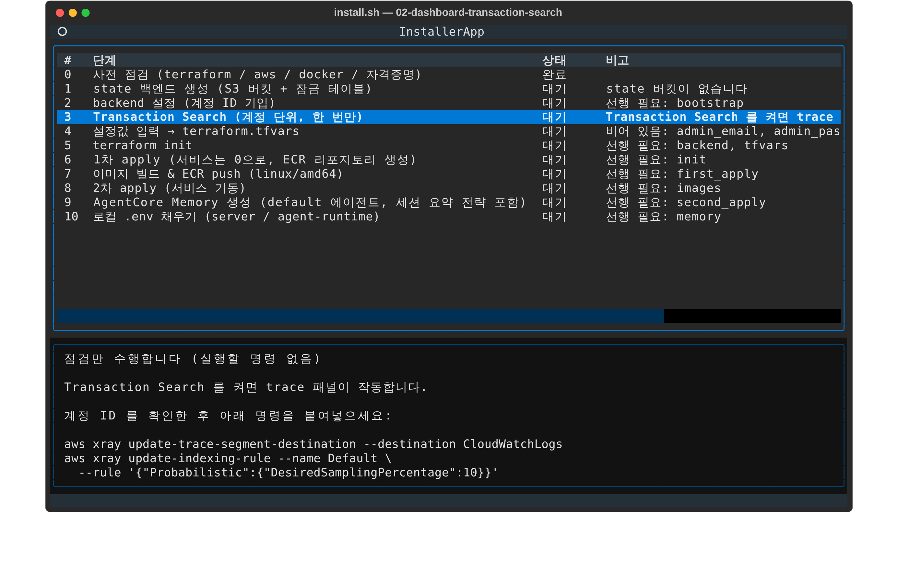

CLI 로 켤 때는 X-Ray 가 스팬을 CloudWatch Logs 에 쓸 수 있도록 로그 리소스 정책을 먼저 두어야
합니다. 이 정책 없이 목적지를 바꾸면 `AccessDeniedException: XRay does not have permission to
call PutLogEvents on the aws/spans Log Group` 오류가 납니다. 콘솔에서 켤 때는 콘솔이 이 정책을
대신 만들어 줍니다.

```bash
REGION=ap-northeast-1
ACCOUNT=$(aws sts get-caller-identity --query Account --output text)

# 1) 로그 리소스 정책
aws logs put-resource-policy --region $REGION --policy-name TransactionSearchXRayAccess \
  --policy-document "{\"Version\":\"2012-10-17\",\"Statement\":[{\"Sid\":\"TransactionSearchXRayAccess\",
    \"Effect\":\"Allow\",\"Principal\":{\"Service\":\"xray.amazonaws.com\"},\"Action\":\"logs:PutLogEvents\",
    \"Resource\":[\"arn:aws:logs:$REGION:$ACCOUNT:log-group:aws/spans:*\",
                 \"arn:aws:logs:$REGION:$ACCOUNT:log-group:/aws/application-signals/data:*\"],
    \"Condition\":{\"ArnLike\":{\"aws:SourceArn\":\"arn:aws:xray:$REGION:$ACCOUNT:*\"},
                  \"StringEquals\":{\"aws:SourceAccount\":\"$ACCOUNT\"}}}]}"

# 2) 스팬 목적지와 샘플링 비율
aws xray update-trace-segment-destination --destination CloudWatchLogs --region $REGION
aws xray update-indexing-rule --name Default --region $REGION \
  --rule '{"Probabilistic":{"DesiredSamplingPercentage":10}}'
```

다른 터미널에서 실행한 뒤 `r` 을 누르면 `완료` 로 바뀝니다. 목적지 변경이 반영되는 데 1~2분
걸리며, 그동안은 비고에 `활성화 중입니다 (Status: PENDING)` 이 표시됩니다. 이 단계는 다른
단계의 선행 조건이 아니므로 나중에 해도 배포는 그대로 진행되며, 켜지 않으면 Trace 패널만
비어 있게 됩니다.

### 4. 설정값 입력 → terraform.tfvars

이 단계에서 `Enter` 를 누르거나 아무 화면에서 `s` 를 누르면 설정 화면이 열립니다. 입력 폼은
`infra/envs/standalone/variables.tf` 를 읽어 자동으로 구성되므로, 변수가 추가되면 폼에도 그대로
나타납니다.

**Required 탭**에는 Terraform 이 기본값 없이 요구하는 네 개의 변수(Cognito 초기 사용자 두
명의 이메일과 비밀번호)와, 기본값은 있지만 직접 정하는 것이 좋은 `bedrock_model_id` 가
있습니다. `*` 가 붙은 항목을 비워 두면 저장이 거부됩니다. 비밀번호는 Cognito 정책에 따라
8자 이상이고 대문자, 소문자, 숫자를 포함해야 하며, 입력하는 즉시 아래에 검증 결과가 나타납니다.

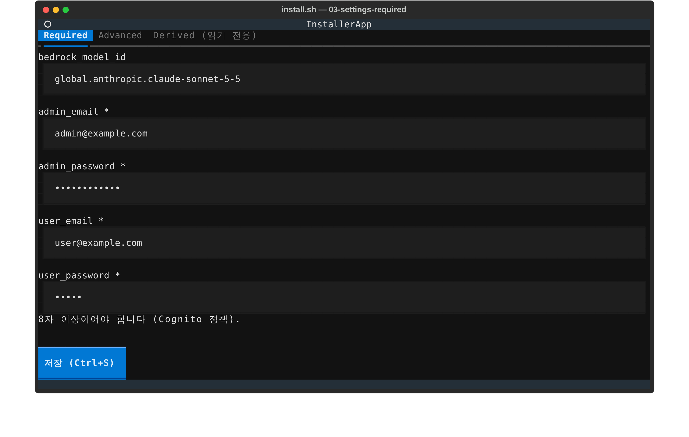

**Advanced 탭**에는 나머지 변수가 모두 있습니다. 자주 수정하게 되는 항목은 다음과 같습니다.

| 변수 | 언제 바꾸는가 |
| --- | --- |
| `project` | 같은 계정에 이미 `bap-*` 리소스가 있을 때. 바꾸면 모든 리소스 이름과 state 버킷 이름이 함께 바뀝니다 |
| `region`, `azs` | 도쿄가 아닌 리전에 올릴 때. 둘을 함께 수정합니다 |
| `alb_ingress_cidrs` | ALB 접근을 사내 대역 등으로 제한할 때 |
| `certificate_arn`, `public_host` | ALB 에서 TLS 를 종료할 때. Entra ID 로그인을 쓰려면 HTTPS 가 필요합니다 |
| `activate_cost_allocation_tags` | 빈 계정에서 1차 apply 가 Billing 태그 활성화에 실패하면 `false` 로 두고, 하루쯤 뒤 `true` 로 되돌립니다 |
| `bucket_suffix` | S3 버킷 이름이 전역에서 이미 사용 중일 때 |
| `enable_agent_registry` | 조직 SCP 가 Agent Registry API 를 막고 있을 때 `false` |

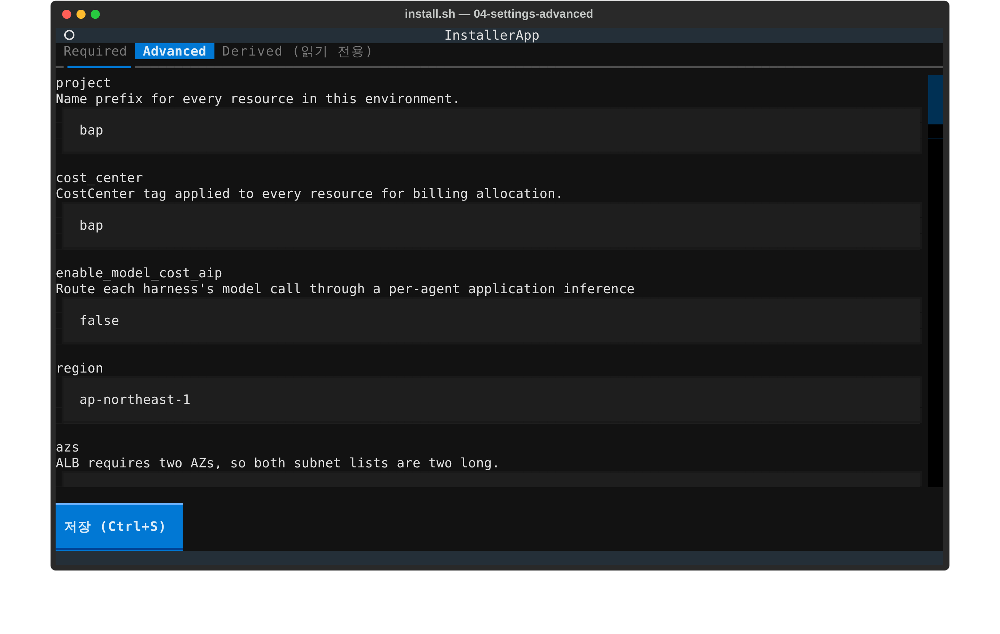

목록(`azs`, `alb_ingress_cidrs` 등)은 쉼표로 구분해 입력하고, `runtime_mcp_servers` 처럼 map
타입인 변수는 `{ "platform-status" = "<runtime ARN>" }` 같은 HCL 표기 그대로, 또는
`platform-status = <runtime ARN>, other = <ARN>` 처럼 `키 = 값` 쌍으로 입력합니다. 비워 두면
`{}` 로 저장됩니다.

입력을 마치면 `Ctrl+S` 나 하단의 저장 버튼으로 저장합니다. 저장 결과는 버튼 위에 한 줄로
표시됩니다. 기존 `terraform.tfvars` 가 있으면
주석과 정렬은 그대로 두고 값이 있는 줄만 바꿉니다. 저장과 함께 `project` 나 `region` 변경이
이후 모든 명령에 반영되고 상태 점검이 다시 실행됩니다. `Esc` 를 누르면 대시보드로 돌아갑니다.

**Derived 탭**은 Terraform output 을 읽기 전용으로 보여 주는 곳입니다. apply 전에는 비어 있고,
배포가 끝나면 접속 주소(`alb_url`), Cognito ID, Gateway URL 등을 여기서 확인할 수 있습니다.

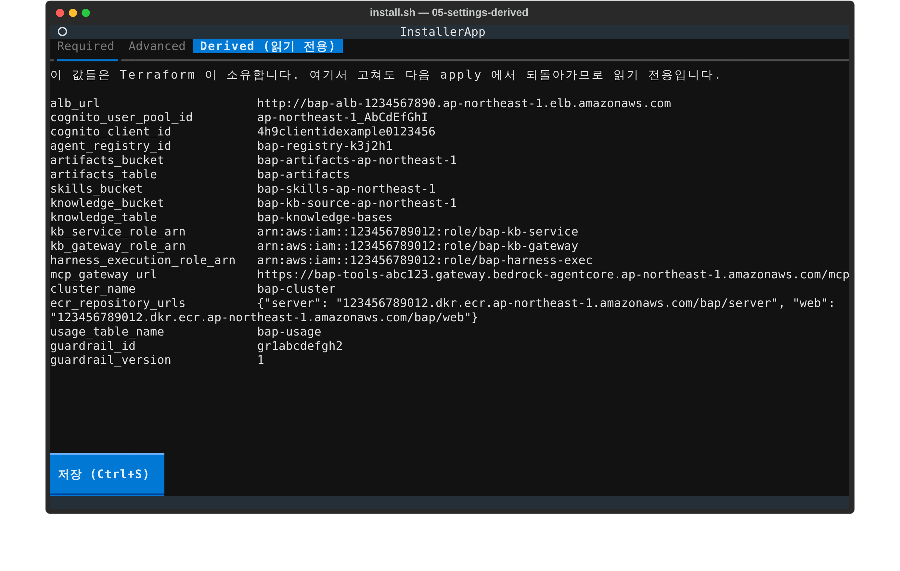

### 5. terraform init

`backend.hcl` 을 backend 설정으로 넘겨 `terraform init` 을 실행합니다. `.terraform/`
디렉터리가 만들어지면 `완료` 입니다.

### 6. 1차 apply

`terraform apply -var desired_count=0` 을 실행합니다. 컨테이너 이미지를 올릴 ECR 리포지토리가
이 apply 에서 만들어지기 때문에 아직 올릴 이미지가 없고, 그래서 ECS 서비스의 태스크 수를 0
으로 두고 인프라만 먼저 올립니다. NAT 게이트웨이와 ALB 생성에 시간이 걸려 보통 10분 안팎
소요됩니다.

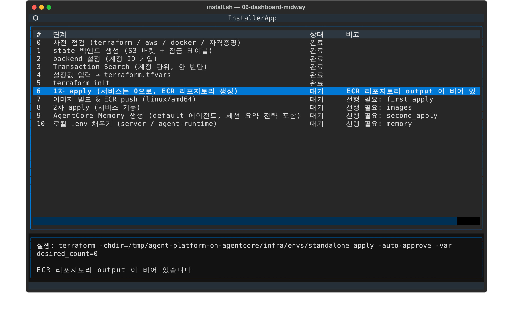

`Enter` 를 누르면 로그 화면으로 바뀌고 terraform 출력이 실시간으로 흐릅니다. 명령이 끝나면
하단에 결과가 표시됩니다.

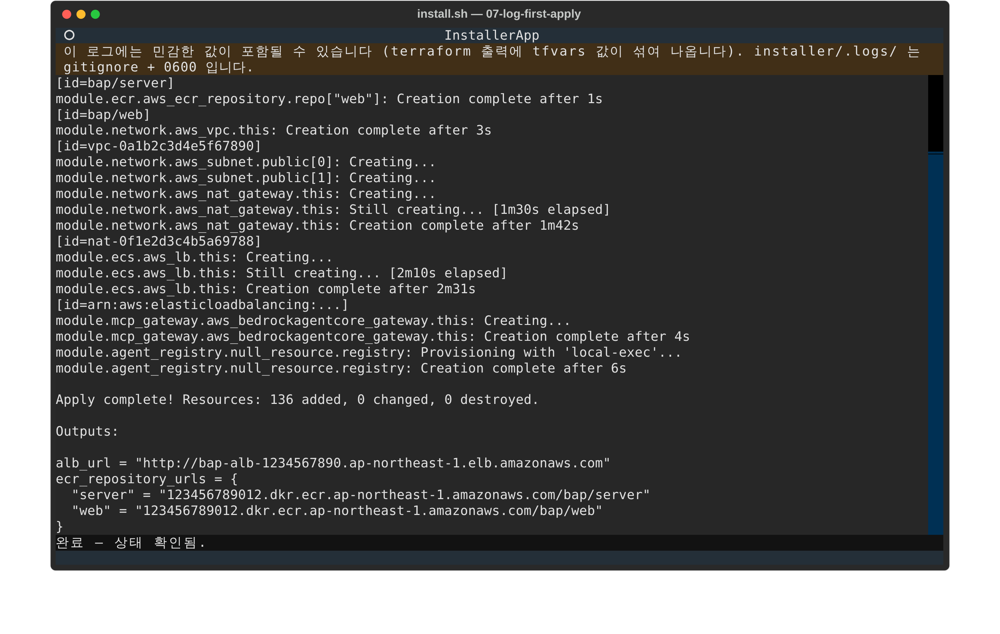

명령이 종료 코드 0 으로 끝나더라도 인스톨러는 그것만으로 완료 처리를 하지 않고 상태를 다시
판정합니다. 1차 apply 의 경우 1차 apply 와 같은 조건(태스크 0개, 자리표시자 이미지)으로
`terraform plan` 을 돌려 남은 변경이 없는지까지 확인하므로, 중간에 실패해 ECR 만 만들어진
apply 가 `완료` 로 잘못 표시되는 일이 없습니다. 같은 이유로 8번 단계에서 서비스가 기동되기
전까지는 `r` 재점검에 수십 초가 걸립니다. 설정을 바꾼 뒤라면 비고에 `남은 변경: Plan: …` 이
표시되는데, 이때는 이 단계를 한 번 더 실행하면 됩니다.

로그 화면 하단에 나오는 결과 문구는 세 가지입니다.

| 문구 | 뜻 |
| --- | --- |
| `완료 — 상태 확인됨` | 명령이 성공했고 상태 판정도 `완료` 입니다 |
| `명령은 성공했지만 아직 완료로 보이지 않습니다` | 종료 코드는 0 이지만 리소스가 확인되지 않았습니다. 로그를 보고 다시 실행합니다 |
| `명령은 성공했지만 상태를 확인할 수 없습니다` | 판정 자체가 실패했습니다(`판정불가`). 비고의 원인을 해결합니다 |

### 7. 이미지 빌드 & ECR push

ECR 에 로그인하고, `server` 와 `web` 두 이미지를 `--platform linux/amd64` 로 빌드해 push 한
뒤, `terraform.tfvars` 의 `server_image` 와 `web_image` 에 이미지 URI 를 기록하는 것까지 한
번에 처리합니다. Fargate 태스크가 x86_64 로 실행되기 때문에 플랫폼 플래그는 항상 붙습니다.
두 리포지토리에 이미지가 하나 이상 있으면 `완료` 로 판정되며, 처음 빌드할 때는 10분 가까이
걸릴 수 있습니다.

### 8. 2차 apply

tfvars 에 기록된 이미지로 ECS 서비스를 기동합니다. 두 서비스의 `desiredCount` 와
`runningCount` 가 모두 1 이상이면 `완료` 입니다. 태스크가 뜨는 데 2~3분 걸리기 때문에, apply
직후에는 `태스크가 아직 뜨지 않았습니다` 라는 비고와 함께 `대기` 로 보일 수 있습니다. 잠시
기다린 뒤 `r` 을 누르면 됩니다.

### 9. AgentCore Memory 생성

`default` Runtime 에이전트가 대화와 세션 요약을 저장하는 AgentCore Memory
`bap_conversations_default` 를 세션 요약 전략과 365일 보존 기간으로 만듭니다. Terraform
provider 에 대응 리소스가 없어 AWS CLI 로 생성합니다. Runtime 에이전트를 당장 붙일 계획이
없더라도 만들어 두는 데 비용은 들지 않습니다.

### 10. 로컬 .env 채우기

Terraform output 과 설정 화면에서 고른 값을 `server/.env` 와 `agent-runtime/.env` 에 씁니다.
파일이 없으면 각 디렉터리의 템플릿(`env.example`, `.env.example`)을 복사한 뒤 해당 키의 줄만
바꾸고, 권한은 0600 으로 둡니다.

| 파일 | 채워지는 값 |
| --- | --- |
| `server/.env` | Cognito ID, Registry ID, 버킷·테이블 이름, KB 역할 ARN, Gateway URL, usage 테이블, 모델 ID, 리전 |
| `agent-runtime/.env` | `MEMORY_ID`, `PLATFORM_API_URL`(ALB 주소), `MCP_GATEWAY_URL`, `GUARDRAIL_ID`/`GUARDRAIL_VERSION`, `EXECUTION_ROLE`(Runtime 실행 역할), 모델 ID, 리전 |

`server/.env` 는 로컬에서 `./run.sh` 로 개발할 때 쓰는 파일입니다. 배포된 ECS 태스크는
Terraform 이 넣어 준 환경 변수를 사용하므로, 이 파일을 고쳐도 운영 중인 서비스에는 영향이
없습니다.

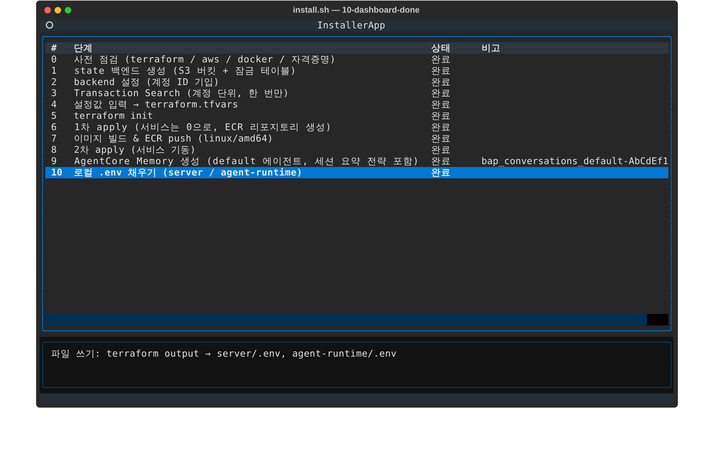

### 접속하기

설정 화면 Derived 탭의 `alb_url` 로 접속해서 Required 탭에 입력한 `admin_email` /
`admin_password` 로 로그인합니다. 터미널에서 주소를 확인하려면 다음을 실행합니다.

```bash
terraform -chdir=infra/envs/standalone output -raw alb_url
```

로그인이 되면 Knowledge, Insights, Registry 화면이 비어 있는 상태로 열립니다. 터미널에서
확인하려면 로그인 API 로 토큰을 받아 설정 API 를 호출해 봅니다.

```bash
URL=$(terraform -chdir=infra/envs/standalone output -raw alb_url)
TOKEN=$(curl -s -X POST "$URL/api/auth/login" -H 'Content-Type: application/json' \
  -d '{"username":"admin@example.com","password":"<admin-password>"}' | python3 -c 'import json,sys; print(json.load(sys.stdin)["access_token"])')
curl -s -H "Authorization: Bearer $TOKEN" "$URL/api/config"
```

Runtime 에이전트를 아직 붙이지 않았다면 채팅의 에이전트 선택에 **기본 채팅**은 나타나지
않습니다. 기본 채팅은 Runtime 에이전트가 답하기 때문입니다. Harness 에이전트는 이 시점부터
바로 만들어 사용할 수 있습니다.

---

## 5. 문제가 생겼을 때

명령이 0 이 아닌 코드로 끝나면 로그 화면 하단에 마지막 출력 40줄, 인스톨러가 해석한 원인과
조치, 전체 로그 파일 경로가 함께 표시됩니다.

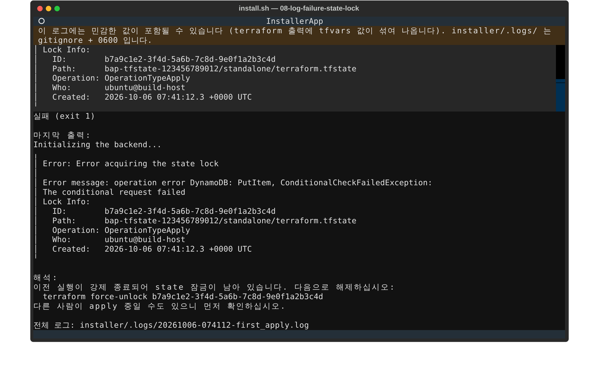

인스톨러가 알아보고 조치를 안내하는 오류는 다음과 같습니다. 목록에 없는 오류는 원문을 그대로
보여 줍니다.

| 출력에 포함된 문자열 | 안내 |
| --- | --- |
| `Inconsistent dependency lock file`, `Backend initialization required` | 그 디렉터리에서 `terraform init` 이 필요합니다. 5번 단계를 실행하거나 직접 init 합니다 |
| `Error acquiring the state lock` | 이전 실행이 강제 종료되어 잠금이 남았습니다. 출력에서 ID 를 찾아 `terraform force-unlock <ID>` 를 실행합니다 |
| `BucketAlreadyExists`, `AlreadyExistsException` 등 | 같은 이름의 리소스가 이미 있습니다. Advanced 탭에서 `project` 또는 `bucket_suffix` 를 바꿉니다 |
| `no valid credential sources`, `ExpiredToken` | 자격 증명이 없거나 만료되었습니다. `aws sso login` 또는 `AWS_PROFILE` 을 확인합니다 |
| `ConflictException`, `another operation is in progress` | AWS 가 직전 작업을 아직 정리하는 중입니다. 잠시 후 재시도합니다 |
| `exec format error`, `CannotPullContainerError` | 이미지 아키텍처가 맞지 않습니다. `linux/amd64` 로 다시 빌드합니다 |
| `ResourceNotFoundException` | 참조하는 리소스가 없습니다. `r` 로 선행 단계가 실제로 끝났는지 재점검합니다 |

전체 로그는 `installer/.logs/<시각>-<단계>.log` 에 남습니다. terraform 출력에는 tfvars 값
(비밀번호 포함)이 섞여 나올 수 있으므로 이 디렉터리는 gitignore 대상이며 파일 권한은 0600 입니다.

**실행을 취소하려면** 로그 화면에서 `Ctrl+C` 를 누르거나 대시보드에서 `q` 를 누릅니다. 실행
중인 명령의 프로세스 그룹 전체(terraform 의 provider 플러그인 포함)에 종료 신호를 보냅니다.
apply 도중에 취소하면 state 잠금이 남을 수 있는데, 이 경우 다음 실행에서 위 표의 force-unlock
안내가 나타납니다. 인스톨러를 `q` 가 아니라 터미널 창을 닫는 방식으로 끝내면 상태 점검용
`terraform plan` 이 잠금을 쥔 채 남을 수 있으므로, 종료는 `q` 로 하세요.

**자격 증명이 만료되면** 모든 단계가 한꺼번에 `판정불가` 로 바뀝니다. 비고에 `ExpiredToken`
같은 원인이 적혀 있으니, 다시 로그인한 뒤 `r` 을 누르면 됩니다.

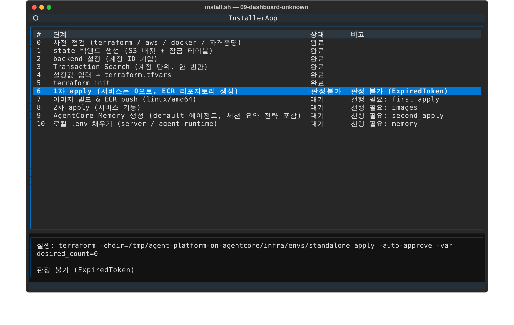

**빈 계정에서 1차 apply 가 `cost_allocation_tags` 에서 실패하는 경우**가 있습니다. AWS Billing
은 태그 키가 청구 데이터에 한 번 나타난 뒤에야 활성화를 받아 주기 때문입니다. Advanced 탭에서
`activate_cost_allocation_tags` 를 `false` 로 저장하고 1차 apply 를 다시 실행하세요. 플랫폼을
하루쯤 사용한 뒤 `true` 로 되돌리고 2차 apply 단계를 한 번 더 실행하면 에이전트별 청구 비용이
Insights 에 나타납니다.

---

## 6. 운영 화면 (`o`)

배포가 끝난 뒤 자주 하게 되는 작업은 운영 화면에 모여 있습니다.

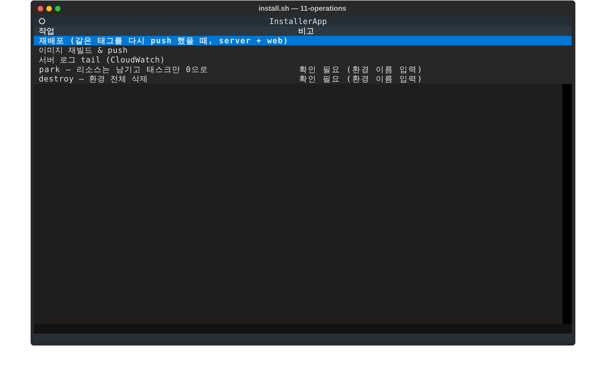

| 작업 | 하는 일 |
| --- | --- |
| 재배포 | `latest` 태그로 이미지를 다시 push 한 뒤 `server`·`web` 서비스를 강제 재배포합니다. Terraform 은 같은 태그의 변경을 감지하지 못하기 때문입니다 |
| 이미지 재빌드 & push | 대시보드 7번 단계와 같은 동작입니다. 그쪽으로 안내합니다 |
| 서버 로그 tail | CloudWatch 의 `/ecs/<project>/server` 로그를 실시간으로 보여 줍니다. 새 로그가 없으면 화면이 비어 있다가 요청이 들어올 때 채워지며, `Ctrl+C` 로 중단합니다 |
| park | `desired_count=0` 으로 apply 해서 ECS 태스크만 내리고 나머지는 보존합니다 |
| destroy | `terraform destroy` 를 실행합니다. 실행 전에 삭제될 리소스 수를 먼저 보여 줍니다 |

`park` 와 `destroy` 는 되돌리기 어려운 작업이라, 환경 이름(`project` 값, 기본 `bap`)을 정확히
입력해야 실행됩니다. destroy 는 확인 창을 열기 전에 `terraform plan -destroy` 를 먼저 돌리므로
창이 뜨는 데 수십 초가 걸리고, 창에는 `Plan: 0 to add, 0 to change, N to destroy.` 처럼 삭제될
리소스 수가 표시됩니다. 이름이 다르면 실행되지 않고, `Esc` 나 취소 버튼으로 닫을 수 있습니다. `--dry-run` 모드에서도 destroy 의 삭제 계획 조회는 읽기 전용이므로
실제로 실행해 보여 줍니다.

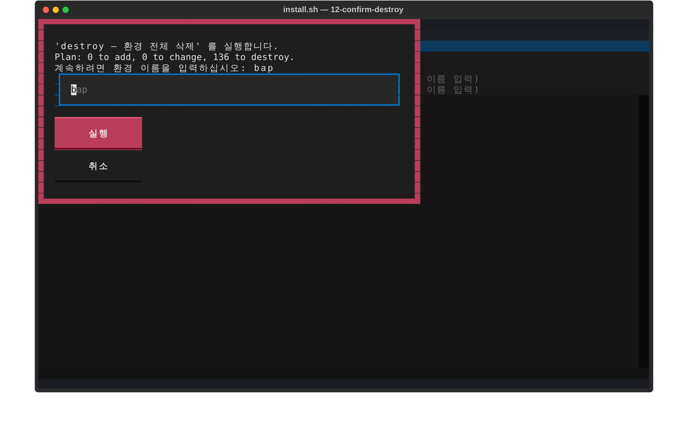

운영 화면의 **park 는 `infra/scripts/park.sh down` 과 범위가 다릅니다.** 여기서는 태스크만
0 으로 내리고 NAT 게이트웨이와 EIP 는 그대로 둡니다. 시간당 요금을 더 줄이려면 스크립트를
사용하세요.

**destroy 를 실행하기 전에는** 두 가지를 먼저 해야 합니다.

1. Terraform 밖에서 만든 것들(웹 화면에서 만든 Harness 와 Knowledge Base, 내장 툴 게이트웨이,
   Runtime 에이전트, Memory)을 지웁니다. 순서는 [`DEPLOYMENT.md` 의 삭제](../DEPLOYMENT.md#삭제)를
   따릅니다.
2. Insights 가 Runtime 사용량 로그를 모으기 위해 만든 CloudWatch Logs delivery 를 지웁니다.
   서버가 떠 있는 동안 리전의 Runtime 마다 `<project>-usage-<runtime>` 이름으로 자동 생성되며,
   Terraform 밖의 리소스이므로 남아 있으면 destroy 가 `DeleteDeliveryDestination` 400 오류로
   멈춥니다.

   ```bash
   R=ap-northeast-1; P=<project>
   for id in $(aws logs describe-deliveries --region $R \
       --query "deliveries[?starts_with(deliverySourceName, '$P-usage-')].id" --output text); do
     aws logs delete-delivery --region $R --id "$id"; done
   for n in $(aws logs describe-delivery-sources --region $R \
       --query "deliverySources[?starts_with(name, '$P-usage-')].name" --output text); do
     aws logs delete-delivery-source --region $R --name "$n"; done
   ```

3. DynamoDB 삭제 보호를 풉니다. 설정 화면 Advanced 탭에서 `allow_destroy` 를 `true` 로 저장하고
   대시보드 **8번(2차 apply)** 을 한 번 실행합니다. 이 과정을 건너뛰면 destroy 가 네트워크와
   서비스를 다 지운 뒤 테이블에서 `Resource cannot be deleted as it is currently protected
   against deletion` 으로 멈춥니다. 확인 창은 `allow_destroy` 가 `true` 가 아니면 이 점을 함께
   경고합니다. 이미 그 상태가 되었다면 남은 테이블의 보호를 CLI 로 풀고 destroy 를 다시
   실행하면 됩니다.

   ```bash
   for t in $(aws dynamodb list-tables --region ap-northeast-1 \
       --query "TableNames[?starts_with(@, '<project>-') && @ != '<project>-tflock']" --output text); do
     aws dynamodb update-table --region ap-northeast-1 --table-name "$t" --no-deletion-protection-enabled
   done
   ```

destroy 가 끝나도 1번 단계가 만든 state 버킷과 잠금 테이블은 남습니다. 완전히 정리하려면
버킷의 객체 버전을 비운 뒤 `infra/bootstrap` 에서 `terraform destroy -var project=<project>` 를
실행합니다.

---

## 7. dry-run 모드

`./install.sh --dry-run` 으로 실행하면 상태 판정은 실제로 하되 명령은 실행하지 않습니다. 단계를
실행하면 조립된 커맨드 한 줄만 보여 주고 끝나며, 파일을 쓰는 단계도 설명만 출력합니다.

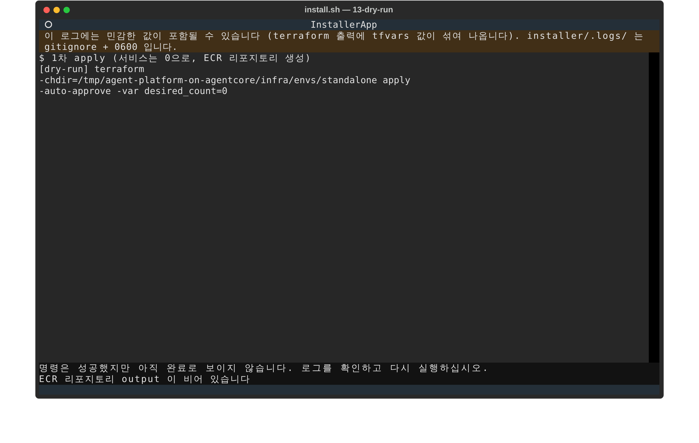

실제로는 아무것도 바뀌지 않았으므로 아직 배포하지 않은 환경에서는 재점검 결과가 그대로
`대기` 이고, 하단에는 "명령은 성공했지만 아직 완료로 보이지 않습니다" 가 나타납니다. 이는
정상적인 동작입니다. 이미 배포된 환경에서 실행하면 상태 판정은 실제 리소스를 보므로 `완료`
로 표시됩니다. 배포 전에
어떤 리전, 접두사, 경로로 명령이 만들어지는지 확인하는 용도로 사용하세요.

---

## 8. 다음 단계: Runtime 에이전트 붙이기

기반 배포가 끝나면 `agent-runtime/.env` 에 Memory ID, ALB 주소, Gateway URL, Guardrail ID,
실행 역할 ARN 이 이미 채워져 있습니다. Runtime 배포 스크립트는 AgentCore starter toolkit 의
`agentcore` CLI 를 사용하므로 `pip install bedrock-agentcore-starter-toolkit` 으로 먼저 설치해
둡니다. Registry 자동 등록에 쓸 관리자 계정만 넘기면 바로 배포할 수 있습니다.

```bash
cd agent-runtime
PLATFORM_ADMIN_USERNAME=admin@example.com PLATFORM_ADMIN_PASSWORD='<admin-password>' \
  AGENT_MODULE=default LONG_TERM_RECALL=true ./scripts/deploy.sh
```

스크립트는 Runtime 이름을 `bap_<AGENT_MODULE>` 로 짓습니다. 같은 리전에 다른 스택이 만든
`bap_default` 가 이미 있다면 그 Runtime 을 덮어쓰게 되므로, 이 경우에는
`AGENT_NAME=<project>_default` 처럼 이름을 따로 지정합니다.

배포된 Runtime 의 ARN 을 설정 화면 Advanced 탭의 `agent_runtime_arn` 에 넣고 저장한 뒤,
대시보드에서 **8번(2차 apply)** 을 다시 실행하면 채팅에 기본 채팅이 나타납니다. 이미 `완료`
인 단계도 `Enter` 로 다시 실행할 수 있습니다. 내장 툴 게이트웨이, MCP Apps 서버, Entra ID
로그인을 붙이는 방법은 [`DEPLOYMENT.md` 의 추가 배포](../DEPLOYMENT.md#추가-배포)를 참고하세요.

---

## 9. 알아 두면 좋은 점

- **Transaction Search 는 직접 실행해야 합니다** (3번 단계). 인스톨러는 명령을 안내만 합니다.
- **`enable_agent_registry` 를 `false` 로 올리면** `agent_registry_id` output 이 비어 10번
  단계가 `완료` 로 바뀌지 않습니다. `.env` 파일 자체는 정상적으로 채워지므로 실제 동작에는
  문제가 없습니다.
- **Memory 이름은 `bap_conversations_default` 로 고정**되어 있습니다. `project` 를 바꿔도 이
  이름은 따라가지 않는데, `deploy.sh` 가 Runtime 을 `bap_<module>` 로 이름 짓는 규칙과 짝을
  맞춘 것입니다.
- **1차 apply 단계의 재점검은 서비스가 뜨기 전까지 느립니다.** `terraform plan` 을 실행하기
  때문에 `r` 을 누르면 수십 초가 걸릴 수 있습니다. 8번 단계가 끝나면 plan 없이 바로 판정합니다.
- **Insights 는 리전 안의 모든 Runtime 에 사용량 로그 delivery 를 붙입니다.** 같은 리전에 다른
  스택의 Runtime 이 있어도 `<project>-usage-<runtime>` delivery 가 생기며, destroy 전에 지워야
  합니다(6장 참고).
- **설정 화면의 입력란은 Tab 으로 이동할 때 값 전체가 선택됩니다.** 원하는 칸에 포커스가 있는지
  확인하고 입력하세요. 잘못 입력했다면 저장 전에 `Esc` 로 나가면 파일은 바뀌지 않습니다.
- **인스톨러는 한 번에 하나만 띄우세요.** 두 인스톨러가 동시에 apply 하면 state 잠금 충돌이
  발생합니다.
