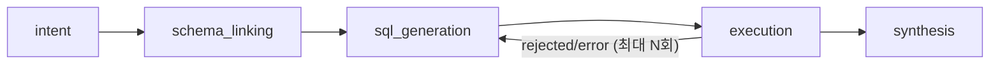
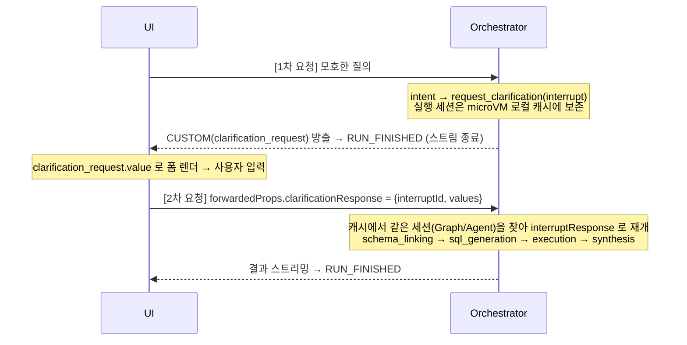

# orchestrator — agentic Text-to-SQL 오케스트레이터 에이전트

Amazon Bedrock AgentCore Runtime 에 배포되는 Strands Agents 기반 오케스트레이터.
자연어 질의를 안전한 PostgreSQL `SELECT` 로 변환·실행·요약한다. AG-UI 프로토콜(SSE)로
UI(CopilotKit)와 스트리밍 통신한다.

## 파이프라인 (Strands Graph)



- **intent**: 질의 의도 해석. 모호하면 `request_clarification` 도구로 사용자에게 되물음(clarification), 명확하면 최선 해석으로 진행
- **schema_linking**: `search_schema`(semantic-retrieval-mcp) 호출로 관련 테이블/컬럼 컨텍스트 수집
- **sql_generation**: 스키마 컨텍스트 기반 PostgreSQL SELECT 생성
- **execution**: `run_sql`(sql-execution-mcp) 호출. `rejected`/`error` 시 오류를 되먹여
  SQL 재생성 (self-correction, 기본 최대 3회) — Graph 조건부 엣지로 인코딩
- **synthesis**: 결과 표 기반 한국어(질의 언어) 자연어 요약

`ORCHESTRATOR_MODE=agent` 로 설정하면 단일 Strands Agent + 도구 2개 폴백 경로로 실행된다
(동일 시스템 프롬프트로 순서 유도).

## 로컬 개발

```bash
# 의존성 설치
uv sync

# 테스트 + 린트 (순수 로직만; LLM/MCP 는 mock 없이 미의존)
uv run pytest
uv run ruff check .
```

> 유닛 테스트는 순수 로직(설정 파싱, MCP 응답 파싱, self-correction 판단, 프롬프트 빌더,
> AG-UI 이벤트 변환, 요청 파싱, URL 조립, Graph 조건 함수, clarification reason/필드 정규화,
> interrupt→CUSTOM 변환, 세션 캐시 LRU, clarification 재개/만료 흐름, 도구 평면 모드 검증·
> gateway suffix 분류·Cognito 토큰 캐시)만 커버한다. 실제 Bedrock/MCP 호출은 통합 테스트(E2E)에서 검증한다.

## 환경 변수

`.env.example` 참고. 핵심:

| 변수 | 설명 |
|---|---|
| `SQL_MCP_ARN` | sql-execution-mcp Runtime ARN |
| `SEMANTIC_MCP_ARN` | semantic-retrieval-mcp Runtime ARN |
| `MEMORY_ID` | AgentCore Memory(STM) ID (비우면 메모리 비활성) |
| `MODEL_ID` | Bedrock Claude inference profile (기본 `us.anthropic.claude-sonnet-5`) |
| `AWS_REGION` | 리전 (기본 `us-west-2`) |
| `MAX_SQL_CORRECTIONS` | self-correction 최대 재시도 (기본 3) |
| `ORCHESTRATOR_MODE` | `graph`(기본) \| `agent`(폴백) |
| `TOOL_PLANE_MODE` | 도구 평면: `direct`(기본) \| `gateway` (아래 절 참고) |
| `GATEWAY_URL` | (gateway 모드) Gateway MCP 엔드포인트 URL |
| `COGNITO_CLIENT_ID` / `COGNITO_USER` / `COGNITO_PASSWORD_SECRET_ARN` / `COGNITO_USER_POOL_ID` | (gateway 모드) Cognito M2M 인증. 비밀번호는 Secrets Manager ARN 으로 전달 |
| `CONFIG_BUNDLE_PARAM` | 활성 Configuration Bundle 포인터를 담은 SSM 파라미터 이름. 비우면 기능 비활성(코드 기본값) |
| `APP_VERSION` | 구조화 로그의 `version.agent` 라벨 (기본 `dev`) |

## 도구 평면(tool plane) 모드 — direct ↔ gateway

오케스트레이터는 MCP 도구를 두 경로로 접근할 수 있으며 `TOOL_PLANE_MODE` 로 전환한다.
설정만 바꾸면 파이프라인(Graph/Agent) 코드는 그대로 동작한다.

| 모드 | 연결 | 인증 | 필수 env |
|---|---|---|---|
| `direct`(기본) | sql/semantic Runtime MCP 서버에 **직접**(클라이언트 2개) | SigV4 (`bedrock-agentcore`) | `SQL_MCP_ARN`, `SEMANTIC_MCP_ARN` |
| `gateway` | **단일** Gateway MCP 엔드포인트가 모든 도구 집약(클라이언트 1개) | Cognito M2M Bearer 토큰 | `GATEWAY_URL`, `COGNITO_*` 4종 |

- **도구 분류(gateway)**: Gateway 는 모든 도구를 한 엔드포인트로 노출하므로, 도구명 **suffix**
  로 분류한다 — `...run_sql` → SQL 도구, `...search_schema` → semantic 도구. Gateway target
  프리픽스(`<TargetName>___run_sql`)가 붙어도 안전하게 매칭된다.
- **인증(gateway)**: `initiate_auth(USER_PASSWORD_AUTH)` 로 Cognito AccessToken 을 받아
  `Authorization: Bearer <token>` 헤더로 전달한다. 토큰은 만료 5분 전까지 microVM 내 캐시에서
  재사용한다. 비밀번호는 `COGNITO_PASSWORD_SECRET_ARN`(Secrets Manager)에서 읽어 LLM/로그에
  노출하지 않는다.
- **사용자 위임(On-Behalf-Of)**: 호출자가 `forwardedProps.userAccessToken`(Cognito
  AccessToken)을 넘기면 M2M 서비스 토큰 대신 그 토큰을 Bearer 로 사용해, 최종 사용자 신원이
  도구 계층까지 전파된다(Cedar 인가·감사가 사용자 principal 기준으로 평가됨).
- **⚠️ 한계 — 기본은 서비스 계정 위임**: 토큰이 없으면 오케스트레이터의 **서비스 계정** 자격으로
  Gateway 에 접근하고, Cedar 정책은 그 서비스 계정 principal 기준으로 평가된다. 채팅 UI 에는
  로그인이 없으므로 기본 경로가 여기에 해당한다.

## 컨테이너 빌드 (ARM64)

```bash
# uv.lock 이 있어야 함 (uv sync 로 생성/커밋)
docker build --platform linux/arm64 -t orchestrator:local .
# docker 실패 시 finch 폴백
finch build --platform linux/arm64 -t orchestrator:local .
```

AgentCore Runtime 규격: `0.0.0.0:8080`, `POST /invocations`(SSE), `GET /ping`, non-root.

## AG-UI 이벤트 포맷 (UI 담당 참고)

`POST /invocations` 는 SSE 로 AG-UI 프로토콜 wire-format(camelCase) 이벤트를 스트리밍한다.
`src/orchestrator/agui_events.py` 가 단일 정의 지점이다.

| 이벤트 | 필드 |
|---|---|
| `RUN_STARTED` | `threadId`, `runId` |
| `RUN_FINISHED` | `threadId`, `runId` |
| `RUN_ERROR` | `message`, (`code`) |
| `STEP_STARTED` / `STEP_FINISHED` | `stepName` (Graph 노드명: intent/schema_linking/sql_generation/execution/synthesis) |
| `TEXT_MESSAGE_START` | `messageId`, `role`(=assistant) |
| `TEXT_MESSAGE_CONTENT` | `messageId`, `delta` |
| `TEXT_MESSAGE_END` | `messageId` |
| `TOOL_CALL_START` | `toolCallId`, `toolCallName`(run_sql/search_schema/request_clarification) |
| `TOOL_CALL_ARGS` | `toolCallId`, `delta`(JSON 조각) |
| `TOOL_CALL_END` | `toolCallId` |
| `CUSTOM` | `name`(=`clarification_request`), `value`(아래 clarification 절 참고) |

요청 페이로드(RunAgentInput)에서 `threadId`→sessionId, `forwardedProps.actorId`(또는 `state.actorId`)
→actorId 를 추출해 AgentCore Memory 세션을 격리한다.

## clarification (재요청) 흐름

질의가 모호하면(기간·지표 정의·대상 미지정 등) intent 단계가 `request_clarification` 도구를
호출해 Strands **interrupt** 를 발생시킨다. 실행이 그 지점에서 정지하고, 오케스트레이터는
`CUSTOM(clarification_request)` 이벤트로 UI 에 폼을 요청한 뒤 정상 `RUN_FINISHED` 로 스트림을
닫는다(연결을 열어둔 채 대기하지 않음). 사용자가 폼을 채워 보내면 **새 HTTP 요청**으로 재개된다.



- `CUSTOM(clarification_request)` 의 `value`:
  ```json
  {"interruptId": "<Interrupt.id>", "interruptName": "clarification",
   "question": "어느 기간의 매출인가요?",
   "fields": [{"name": "period", "label": "기간", "type": "select", "options": ["이번달", "지난달"]}]}
  ```
  `type` 은 `select` | `date_range` | `text` (그 외 값은 `text` 로 강등). `options` 는 `select` 에만.
- **재개 페이로드**: `forwardedProps.clarificationResponse = {"interruptId": str, "values": {<field name>: <값>}}`
  (`state.clarificationResponse` 도 수용). `request.py` 가 `ParsedRequest.clarification_response` 로 파싱.
- **세션/재개 전략**: 재개는 **같은 microVM 내 모듈 레벨 캐시**(session_id → 실행 세션)에 의존한다.
  interrupt 로 정지한 Graph/Agent 인스턴스와 열린 MCP 클라이언트를 캐시에 살려두었다가 2차 요청에서
  같은 인스턴스로 재개한다(LRU, 기본 상한 32).
- **한계 — 세션 매니저 영속화 미지원**: `AgentCoreMemorySessionManager` 는 multiagent(Graph) 세션
  영속화를 지원하지 않는다(`create/read/update_multi_agent` 미구현 → 상위 `SessionRepository` 가
  `NotImplementedError`). 따라서 Graph 에는 세션 매니저를 연결하지 않고 캐시 전략만 쓴다. 캐시 미스
  (microVM 교체 등)로 재개할 수 없으면 `RUN_ERROR` 대신 질문을 다시 하도록 안내하는 안내 메시지 +
  `RUN_FINISHED` 로 마무리한다(로그 코드 `CLARIFICATION_EXPIRED`). 단일 Agent 모드도 동일 CUSTOM 계약을 따른다.

## 구조화 로그 `t2sql_query_record` (관측·평가·후보 채굴의 단일 원천)

실행이 끝날 때(성공/실패/clarification 모두) stdout 에 아래 1줄을 남긴다. AgentCore Runtime
은 stdout 만 CloudWatch 로 보내므로 앱 모듈에서 stdout 핸들러를 명시한다.

```
t2sql_query_record {"question": "...", "sql": "SELECT ...", "status": "ok",
                    "session_id": "...", "version": {"bundle": "default", "agent": "dev"}}
```

| 필드 | 의미 |
|---|---|
| `question` | 사용자 질의 원문 (없으면 `null`) |
| `sql` | 마지막으로 실행 시도한 SQL (없으면 `null`) |
| `status` | `ok` \| `error` \| `clarification` |
| `session_id` | 실행 세션 ID (AgentCore runtimeSessionId) |
| `version.bundle` | 적용된 Configuration Bundle 라벨 `"<bundleId>@<versionId>"`, 미적용 시 `"default"` |
| `version.agent` | `APP_VERSION` 값 (기본 `dev`) |

- **소비자**: 평가(EX evaluator)의 스팬 파싱과 후보 채굴(`mine_candidates`)이 이 마커를
  `FilterLogEvents` 로 찾는다. 따라서 **마커 문자열과 위 필드는 제거·개명하지 않는다** —
  확장은 신규 필드 추가(additive only)로만 한다.
- 로깅 실패는 요청 흐름을 막지 않는다(예외 흡수).

## 활성 Configuration Bundle 오버라이드

`CONFIG_BUNDLE_PARAM` 이 설정돼 있으면 SSM 파라미터
(`{"bundleId": "...", "versionId": "..."}`)를 읽고 해당 bundle 버전의
`components["orchestrator"]["configuration"]` 에서 `system_prompt` / `model_id` 를 가져와
코드 기본값을 오버라이드한다. bundle 승격은 곧 **이 SSM 포인터 전환**이다.

- warm microVM 이 매 요청마다 control-plane 을 호출하지 않도록 모듈 레벨 TTL 캐시(60초)를 둔다.
- **어떤 실패도 경고 로그 + 코드 기본값 폴백**이다 — bundle 조회가 에이전트 가용성을 떨어뜨리지
  않는다.

## 보안 참고

- SQL 안전은 **sql-execution-mcp 도구 핸들러**(SQLGlot AST allow-list + read-only DB 사용자)가
  최종 방어선이다. 오케스트레이터는 시스템 프롬프트로 SELECT-only 를 유도할 뿐, 강제는 도구 계층이 담당한다.
- MCP 접속은 SigV4(`bedrock-agentcore` 서비스) 서명. DB 자격증명은 에이전트/LLM 컨텍스트에 노출되지 않는다.

## 범위 밖 (후속)

- Long-term memory / 개인화 — 현재는 short-term memory(세션 히스토리)만 사용
- clarification 재개의 microVM 간 영속화 — 현재는 microVM 로컬 캐시(같은 VM 내)만 지원
