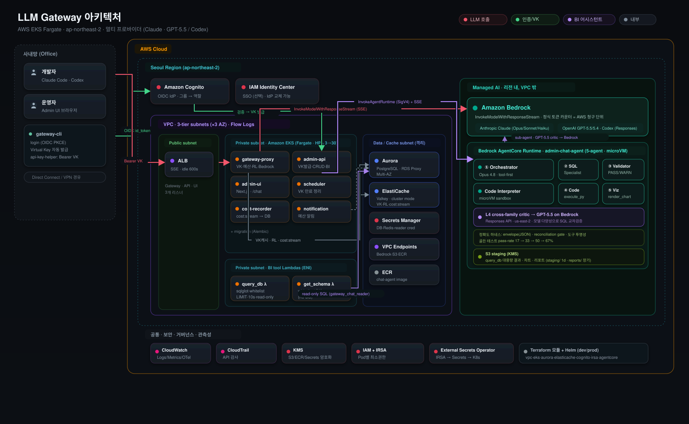
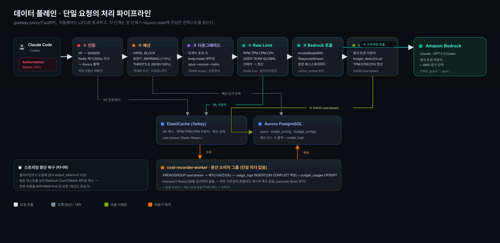
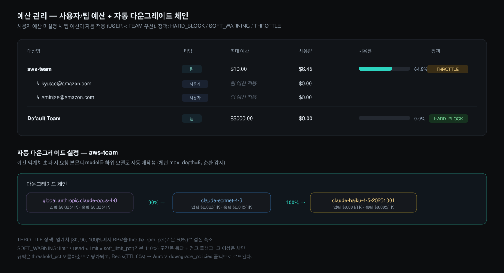
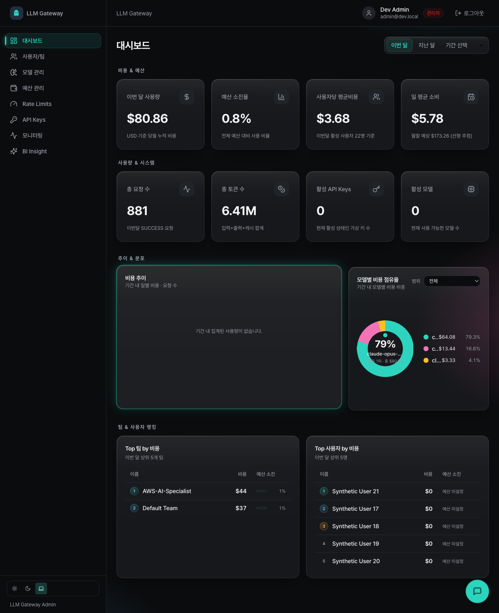
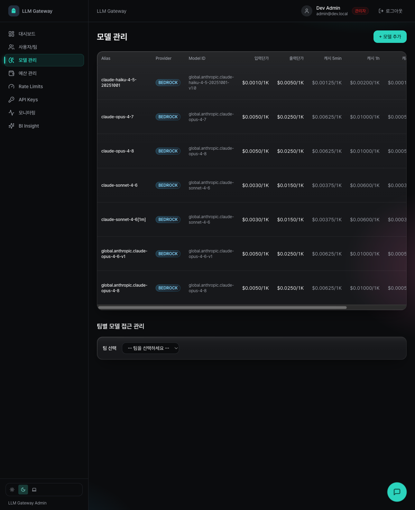

# Agentic AI를 품은 LLM Gateway: Amazon Bedrock 위에서 Claude Code·Codex를 거버넌스하기

> *"개발자 전원에게 Claude Code를 열어주고 싶습니다. 그런데 누가 얼마를 쓰는지, 어떤 모델에 접근하는지, 예산을 넘기면 어떻게 막을지를 모른 채로 열어도 될지 확신이 서지 않습니다."*

이 고민은 2026년 현재 거의 모든 기술 조직이 마주하는 현실입니다. 생성형 AI 코딩 도구는 더 이상 실험이 아니라 일상 도구가 되었고, [Claude Code](https://www.anthropic.com/claude-code)는 환경변수 하나(`CLAUDE_CODE_USE_BEDROCK=1`)만으로 Amazon Bedrock 위에서 곧바로 동작합니다. 그리고 이제는 Claude만의 이야기가 아닙니다. 2026년 6월 [OpenAI의 GPT-5.5·GPT-5.4 모델과 Codex가 Amazon Bedrock에서 정식 사용 가능](https://aws.amazon.com/blogs/aws/get-started-with-openai-gpt-5-5-gpt-5-4-models-and-codex-on-amazon-bedrock/)해지면서, OpenAI의 Codex 같은 코딩 에이전트도 최신 프런티어 모델로 같은 Bedrock 백엔드 위에서 동작합니다. 어떤 에이전트를 쓰든 개인 개발자에게는 더없이 편리합니다. 하지만 수백 명 규모의 조직에 그대로 풀어놓는 순간 네 가지 통제 불능 영역이 생깁니다. 누가 쓰는지 알 수 없고(인증), 얼마를 쓰는지 사후에도 분해할 수 없으며(비용), 어떤 모델에 접근하는지 제어할 수 없고(거버넌스), 그 모든 활동을 추적·감사할 수단이 없습니다(관측성).

이 글에서는 바로 이 네 가지 공백을 메우기 위해 우리가 직접 구축한 **사내 LLM Gateway**의 설계를 처음부터 끝까지 따라가 봅니다. 게이트웨이는 사내 OIDC 인증으로 Virtual Key를 자동 발급하고, 모든 LLM 요청을 Bedrock으로 프록시하면서 팀·사용자별 예산, Rate Limit, 모델 접근 제어, 그리고 토큰 단위의 정확한 사용량 추적을 수행합니다.

그런데 한 가지 흐름을 미리 짚어 두려 합니다. 게이트웨이의 존재 이유는 결국 **거버넌스**이고, 거버넌스는 *통제(control)*만으로 완성되지 않습니다. 무엇을 막을지, 누구의 예산을 조일지, 어떤 모델을 다운그레이드할지 결정하려면 먼저 *정확하게 봐야* 합니다. 즉 거버넌스는 모니터링을 요구하고, 의미 있는 모니터링은 단순 대시보드를 넘어 "지난 24시간 429를 가장 많이 받은 사용자", "예산 80%에 도달한 팀의 모델별 비용 추세" 같은 *임의의 운영 질문에 정확히 답하는 분석*을 요구합니다. 우리가 게이트웨이 위에 **AI BI 어시스턴트**를 얹은 것은 그래서 부가 기능이 아니라 거버넌스 루프의 마지막 고리입니다. 운영자가 자연어로 운영 데이터를 물으면, 5개의 전문 에이전트가 [Strands Agents](https://strandsagents.com/) 패턴으로 [Amazon Bedrock AgentCore Runtime](https://docs.aws.amazon.com/bedrock-agentcore/) 위에서 협업해 검증된 SQL과 차트로 답합니다. 통제(데이터 평면)와 통찰(분석)이 같은 게이트웨이 안에서 하나의 닫힌 고리를 이루는 셈입니다.

그래서 이 글의 주인공은 **Agentic AI를 품은 LLM Gateway**입니다. 게이트웨이라는 *통제 평면* 안에 다중 에이전트 분석이라는 *두뇌*가 들어앉아, **통제 → 관측 → 분석 → 다시 통제**로 도는 하나의 거버넌스 루프를 완성합니다. 글의 전반부(§1~5)는 이 루프의 통제·관측 축, 곧 인증·예산·Rate Limit·모델 거버넌스를 다루고, 후반부(§6~8)는 그 루프를 닫는 두뇌, 곧 agentic AI 분석을 다룹니다.

다만 두뇌가 *틀린 숫자*를 내놓으면 그 위의 모든 통제 결정이 함께 틀어지므로, 분석에는 신뢰 장치가 필요합니다. 우리는 이를 위해 LLM을 모델 *바깥에서* 통제하는 안전장치를 둘렀는데, AWS [Deep Insight 시리즈](https://aws.amazon.com/ko/blogs/tech/harness-engineering-from-deep-insight/)는 이런 "모델을 제외한 주변 통제 일체"를 **하네스(harness)**라고 부릅니다. 하네스는 §6에서 분석의 정확도를 떠받치는 조연으로 등장합니다. 이 글의 중심은 어디까지나 *agentic AI가 거버넌스 루프를 완성한다*는 한 줄입니다.

> **Disclaimer**: 본 글은 자사 PoC 구현을 정리한 것으로 특정 서드파티 제품을 권장하지 않으며, 인용된 외부 통계는 각 출처의 발표 시점을 기준으로 합니다. 코드 인용은 구조 설명을 위해 단순화되었고, 실제 비용·보안 설정은 각 조직 환경에 맞게 검토하시기 바랍니다.

---

## 1. 지금 거버넌스가 중요해진 이유

기술적 설계로 들어가기 전에, 이 문제가 왜 더 이상 미룰 수 없는 과제가 되었는지 먼저 짚겠습니다. 세 가지 흐름이 동시에 일어나고 있기 때문입니다.

**첫째, 사용은 이미 폭발했지만 통제는 따라가지 못하고 있습니다.** Microsoft와 LinkedIn이 2024년 발표한 [Work Trend Index](https://www.microsoft.com/en-us/worklab/work-trend-index/ai-at-work-is-here-now-comes-the-hard-part)에 따르면, 지식 근로자의 **75%가 이미 업무에 AI를 사용**하고 있고, 그중 **78%는 회사가 제공하지 않은 자신의 AI 도구를 몰래 들고 와서 쓰고 있습니다(BYOAI, Bring Your Own AI)**. 다시 말해 대부분의 AI 사용이 조직의 시야 바깥, 이른바 "Shadow AI" 영역에서 일어나고 있습니다. 통제되지 않은 도구로 사내 코드와 데이터가 빠져나가도 조직은 그 사실조차 알기 어렵습니다. 중앙 게이트웨이는 이 사용을 *양지로 끌어올려* 가시성과 통제권을 회복하는 첫걸음입니다.

**둘째, 비용 구조가 역설적으로 위험해졌습니다.** Deloitte의 [Tech Trends 2026](https://www.deloitte.com/us/en/insights/topics/technology-management/tech-trends.html) 보고서는 Stanford HAI의 AI Index를 인용해 **토큰 단가가 2년 만에 약 280배 하락**했다고 전합니다. 토큰이 싸졌으니 안심할 것 같지만, 같은 보고서는 바로 그 때문에 **일부 기업이 월 수천만 달러 규모의 LLM 청구서**를 받고 있다고 지적합니다. 단가 하락이 사용량 폭증을 부르고, 사용량 폭증이 총비용을 끌어올리는 구조입니다. 이때 비용을 *요청 단위로 누구에게 귀속*시킬 수단이 없으면, 조직은 거대한 청구서를 받아 들고도 그것이 어느 팀·어느 프로젝트에서 나온 것인지 분해할 수 없습니다.

**셋째, 실패율과 규제가 동시에 압박하고 있습니다.** Gartner는 (앞의 Deloitte 보고서에 인용된 바에 따르면) **2027년 말까지 에이전트형 AI 프로젝트의 40% 이상이 취소될 것**으로 전망합니다. 주된 이유는 비용 통제 실패와 불명확한 비즈니스 가치입니다. 한편 규제 시계는 멈추지 않습니다. [EU AI Act 시행 일정](https://artificialintelligenceact.eu/implementation-timeline/)에 따르면 금지 AI 관행은 2025년 2월 2일, 범용 AI 모델(GPAI) 의무는 2025년 8월 2일부터 이미 적용되고 있으며, **고위험 AI 시스템 의무는 2026년 8월 2일**부터 적용됩니다. 감사 추적, 모델 인벤토리, 사용 기록 같은 거버넌스 산출물은 이제 "있으면 좋은 것"이 아니라 규제 대응의 전제 조건입니다.

여기에 보안 표준의 관점도 더해집니다. [OWASP Top 10 for LLM Applications (2025)](https://genai.owasp.org/llm-top-10/)는 프롬프트 인젝션(LLM01), 민감정보 노출(LLM02), 그리고 특히 **무제한 소비(LLM10, Unbounded Consumption)**를 핵심 위험으로 명시합니다. 이 위험들은 팀마다 개별적으로 방어하기 어렵고, *중앙 집행 지점*에서 한 번에 막는 편이 훨씬 효율적입니다. Rate Limit, 비용 상한, 모델 화이트리스트가 바로 그런 중앙 통제 장치입니다.

정리하면, **사용은 이미 일어났고(75%), 그 대부분이 통제 밖이며(78% BYOAI), 비용은 역설적으로 커지고(월 수천만 달러), 실패율(40%)과 규제(2026년 8월)가 동시에 다가오고 있습니다.** 게이트웨이는 이 네 가지 압력에 대한 단일한 답입니다.

### 직접 연결과 게이트웨이의 차이

같은 이야기를 Claude Code의 두 가지 배포 방식으로 좁혀 보면 차이가 선명해집니다.

| 항목 | Claude Code 직접 연결 | Claude Code + LLM Gateway |
|---|---|---|
| **인증/보안** | 개인이 Bedrock IAM 자격증명을 직접 보유. 키 유출 시 추적·회수 곤란 | 사내 인증(OIDC/SSO/Cognito) 연동, 로그인 시 **Virtual Key 자동 발급**(유효 1시간) |
| **비용 가시성** | 개인·팀 사용량 분리 불가, 사후 분해 불가 | 매 요청마다 토큰·비용·모델을 **사용 기록으로 저장**(Bedrock 정식 토큰 카운터) |
| **거버넌스** | 모델 선택·한도·팀별 허용 범위를 조직이 통제 불가 | 개인/팀 예산, 팀별 허용 모델, 임계 초과 시 자동 다운그레이드·차단 |
| **감사** | 누가 무엇을 했는지 중앙 로그 없음 | `usage_logs` + CloudTrail + Bedrock invocation log로 **교차 검증** |

핵심은 비용의 비대칭성입니다. 한 명의 개발자가 무심코 대형 컨텍스트를 반복 호출하면 월 수천 달러가 나올 수 있는데, 직접 연결 구조에서는 그것이 *누구의* 비용인지조차 사후에 알 수 없습니다. 게이트웨이는 이 비용을 요청 단위로 귀속시키고, 예산 임계치에서 사후 청구서가 아니라 *선제적으로* 개입합니다.

---

## 2. 오픈소스 게이트웨이와의 차별점

"이미 나와 있는 오픈소스 LLM 프록시를 쓰면 되지 않나"라는 질문은 정당하고, 실제로 기능의 상당 부분은 겹칩니다(범용 오픈소스 게이트웨이는 좋은 출발점입니다). 우리가 직접 구축하면서 의식적으로 강화한 지점은 *정상 경로*가 아니라 **실패 경로**에서의 행동이었습니다. 하네스 엔지니어링의 첫 교훈인 *"하네스는 실패를 다룰 때 가장 빛난다"*가 게이트웨이 코어에도 그대로 적용됩니다.

| 항목 | 일반적 접근 | 본 게이트웨이 |
|---|---|---|
| **토큰 사용량 정확도** | LLM provider가 응답으로 돌려준 숫자만 신뢰(billing과 오차 가능) | Bedrock **정식 토큰 카운터** + CountTokens API로 AWS 청구 단위와 정합 |
| **스트리밍 중단 시 비용** | 응답 도중 끊기면 비용 기록 누락 | 끊긴 시점까지 받은 텍스트로 토큰을 역산해 **부분 비용 보존** |
| **비용 기록 워커 장애** | 단일 DB writer(leader) 구조. leader가 죽으면 정체 | 여러 워커가 Redis Stream **소비자 그룹**에서 분산 처리 |
| **워커 재시작 연쇄사고** | 사용량 기록기 down 시 게이트웨이 전체 down | liveness가 외부 의존성을 검사하지 않아 **cascade-down 방지** |
| **인증 경로 판정** | 프레임워크가 재구성한 URL 경로에 의존하면 Host 헤더 조작에 취약 | 모든 미들웨어가 **ASGI 원시 `scope["path"]`**만 사용 + 미등록 경로 기본 거부 |

이 다섯 가지는 뒤에서 코드와 함께 하나씩 다시 등장합니다. 지금은 "우리가 *다르게* 신경 쓴 지점"의 목록으로만 기억해 두면 됩니다.

마지막 행은 단순한 모범 사례가 아니라 실제 사고를 배경으로 둡니다. 2026년 공개된 [CVE-2026-49468](https://cybersecuritynews.com/litellm-vulnerability-host-header-injection/)은 널리 쓰이는 한 오픈소스 LLM 프록시의 **Host 헤더 인젝션을 통한 인증 우회**입니다. 인증 레이어가 Starlette가 Host 헤더로 *재구성한* `request.url.path`로 경로를 판정하는 반면 실제 라우팅은 다른 경로로 처리되는 불일치를 악용해, 인증 없이 관리 엔드포인트에 접근하고 LLM API 키를 탈취할 수 있는 결함입니다.

우리 게이트웨이는 이 취약점 클래스에 네 겹으로 해당하지 않습니다. **첫째, 범용 오픈소스 프록시를 그대로 쓰지 않고 자체 프록시를 구현했습니다.** 코드에 외부 프록시 라이브러리의 import나 의존성은 없으며, 차용한 것은 Rate Limit의 TTL 보존 *알고리즘 패턴* 정도입니다. 따라서 영향받는 버전 범위 자체에 들지 않습니다. **둘째, 경로 판정이 Host 헤더와 독립입니다.** 모든 인증·예산·Rate Limit 미들웨어가 프레임워크가 재구성한 URL이 아니라 ASGI 서버(uvicorn)가 요청 라인에서 파싱한 원시 경로(`scope["path"]`)만 읽습니다. 인증이 보는 경로와 라우팅이 보는 경로가 *같은 값*이므로 불일치가 발생할 수 없고, 등록되지 않은 경로는 기본적으로 401로 거부합니다.

```python
# gateway-proxy/src/app/middleware/auth.py — 경로 판정은 ASGI 원시 scope만 사용
path: str = scope.get("path", "")          # Host 헤더로 재구성된 URL이 아님
strategy = resolve_auth_strategy(path)
if strategy is None:                        # 미등록 경로 = 기본 거부(deny-by-default)
    await self._send_401(scope, send, "Unknown route")
    return
```

**셋째, 관리 API는 경로 매칭으로 인증을 걸지 않습니다.** 민감한 엔드포인트가 모인 admin-api는 *경로를 보는 미들웨어 자체가 없고*, 각 핸들러가 `Depends(require_admin)` / `require_admin_or_team_leader`로 Cognito JWT와 역할을 직접 바인딩합니다. "인증 레이어와 라우팅 레이어가 경로를 다르게 본다"는 공격면이 구조적으로 존재하지 않으며, 인증을 우회해 경로에 도달하더라도 관리 작업이 거부됩니다. **넷째, ALB 호스트 라우팅 뒤에 배치됩니다.** CVE 문서가 "영향받지 않는 환경"으로 명시한 *호스트 기반 라우팅 클라우드 로드밸런서* 조건을 이미 충족하며, 사용자 신원 검증에 쓰이는 STS 호출에는 별도의 host allowlist(`sts.{region}.amazonaws.com`)와 `Action=GetCallerIdentity` 강제까지 둡니다.

(이 글은 특정 오픈소스 제품의 결함을 지적하려는 것이 아니라, *경로 판정을 프레임워크 재구성 값에 의존하지 않고 ASGI 원시 경로만 신뢰한다*는 설계 원칙이 왜 중요한지를 보여주기 위한 예시로 인용합니다. 해당 CVE의 영향 범위에 있는 제품을 운영 중이라면 각 제품의 패치 버전으로 업그레이드하시기 바랍니다.)

### Claude만이 아니다: GPT-5.5와 Codex도 Bedrock 위에서

이 글을 쓰는 2026년 6월 시점에서, Bedrock의 의미는 한 번 더 넓어졌습니다. 이제 Bedrock 위에서 도는 것은 Anthropic Claude만이 아닙니다. 2026년 6월 1일 AWS는 [OpenAI의 프런티어 모델 GPT-5.5·GPT-5.4와 Codex를 Amazon Bedrock에서 바로 쓸 수 있다](https://aws.amazon.com/blogs/aws/get-started-with-openai-gpt-5-5-gpt-5-4-models-and-codex-on-amazon-bedrock/)고 발표했습니다. 모델 ID는 각각 `openai.gpt-5.5`, `openai.gpt-5.4`이며(앞서 공개된 오픈 웨이트 `openai.gpt-oss-120b`·`gpt-oss-20b`도 함께), [공식 안내 페이지](https://aws.amazon.com/bedrock/openai/)는 *"Handle large codebases using Codex via Bedrock for enterprise-scale development"* 라고 명시합니다. Codex는 Bedrock API 키 또는 AWS SDK 자격증명 체인으로 인증하고, GPT-5.x는 chat/completions가 아니라 **Responses API**로 호출됩니다.

요컨대 **Claude Code뿐 아니라 OpenAI의 Codex 같은 코딩 에이전트도, 그것도 GPT-5.5 같은 최신 프런티어 모델로, 같은 Bedrock 백엔드 위에서 동작**합니다. 조직 입장에서 "어떤 코딩 에이전트를 표준으로 삼을 것인가"는 더 이상 게이트웨이 인프라를 가르는 문제가 아닙니다. 인증·비용·거버넌스를 한 곳에서 통제하면 그 위에서 Claude를 쓰든 Codex를 쓰든 상관없기 때문입니다.

바로 이 지점이 우리가 게이트웨이를 처음부터 **멀티 프로바이더**로 설계한 이유입니다. 게이트웨이는 두 개의 프로바이더 타입과 두 개의 API 포맷을 1급 시민으로 모델링합니다.

```python
# gateway-proxy/src/app/schemas/domain.py
class ProviderType(str, Enum):
    BEDROCK = "BEDROCK"           # Anthropic Claude (Messages API)
    OPENMODEL = "OPENMODEL"       # OpenAI 호환 (GPT-5.x / Codex / 사내 vLLM 등)

class ApiFormat(str, Enum):
    BEDROCK_NATIVE = "BEDROCK_NATIVE"        # /v1/messages (Anthropic)
    OPENAI_COMPATIBLE = "OPENAI_COMPATIBLE"  # /v1/chat/completions, /v1/completions
```

덕분에 게이트웨이는 Claude용 `/v1/messages`와 함께 **OpenAI 호환 엔드포인트**(`/v1/chat/completions`, `/v1/completions`, `/v1/models`)를 나란히 제공합니다(`routers/openai_compat.py`). 그리고 결정적으로, **앞서 설명한 거버넌스 파이프라인(VK 인증, 예산, Rate Limit, 자동 다운그레이드, 비용 기록)이 두 경로에 동일하게 적용**됩니다. 다운그레이드 미들웨어는 OpenAI 경로를 인지해(`_is_openai_path`) 해당 포맷의 모델을 해석하고, 비용 집계 역시 OpenAI 경로에서는 `tiktoken`(cl100k_base) 기반 근사로 출력 토큰을 역산해 같은 `cost:stream`에 흘려보냅니다. *어떤 에이전트가 어떤 모델을 부르든 거버넌스는 한 곳에서 일관되게 집행*되며, 이것이 단순 프록시와 거버넌스 게이트웨이를 가르는 차이입니다.

그리고 이것은 우리에게 이미 *가설이 아니라 동작하는 코드*입니다. 뒤에서 다룰 BI 어시스턴트(§6)는 심층(deep) 분석의 고위험 질의에 한해, SQL 검증의 마지막 단계에서 **Claude와 다른 패밀리인 GPT-5.5를 선택적으로 호출**해 "이 SQL이 질문의 의도와 일치하는지"를 역번역 렌즈로 교차 검토할 수 있습니다. 같은 패밀리끼리는 같은 실수를 공유하기 쉬우므로, *모델 다양성 자체를 검증 장치로* 쓰는 발상입니다(기본은 OFF이며 `CRITIC_ENABLED`로 켜는 opt-in 게이트입니다. 상세 조건은 §6.3에서 다룹니다). 이 cross-family critic이 켜졌을 때 호출하는 대상이 바로 Bedrock 위의 GPT-5.5입니다.

```python
# admin-chat-agent/src/agent/main.py — L4 cross-family critic (GPT-5.5 on Bedrock)
MODEL_CRITIC_ID = os.environ.get("MODEL_CRITIC_ID", "openai.gpt-5.5")
MANTLE_REGION   = os.environ.get("MANTLE_REGION", "us-east-2")   # GPT-5.5: 오하이오

from openai import BedrockOpenAI
from aws_bedrock_token_generator import provide_token
client = BedrockOpenAI(aws_region=MANTLE_REGION,
                       bedrock_token_provider=lambda: provide_token(region=MANTLE_REGION))
resp = client.responses.create(model=MODEL_CRITIC_ID, input=f"{system}\n\n{payload}")  # Responses API
```

> 본 PoC의 부하 테스트와 BI 어시스턴트의 정확도·동시성 수치는 Claude(Bedrock native) 경로를 기준으로 측정되었습니다. OpenAI 호환 데이터 평면 경로(Codex 등)는 동일한 미들웨어 파이프라인을 공유하도록 설계·구현되어 있고, GPT-5.5는 위와 같이 BI 어시스턴트의 교차검증 경로에서 실제 호출됩니다. 모델 ID·리전 등 세부는 빠르게 바뀌므로 배포 전 공식 페이지로 재확인하시기 바랍니다.

---

## 3. 솔루션 아키텍처

전체 시스템은 AWS EKS Fargate(ap-northeast-2) 위에 올라가며, 크게 세 갈래의 흐름으로 나뉩니다. 아래 다이어그램에서 색으로 구분되는 세 경로, 곧 인증(녹색)·LLM 호출(적색)·BI 어시스턴트(보라색)가 이 글의 뼈대입니다.



흐름을 말로 풀면 이렇습니다. 사용자가 `gateway-cli`로 로그인하면 OIDC(PKCE)를 거쳐 사내 IdP(이 PoC에서는 Cognito)가 토큰을 발급하고, `admin-api`가 그 토큰을 검증해 Virtual Key를 내줍니다(녹색). 이후 코딩 에이전트(Claude Code 또는 Bedrock 위에서 도는 Codex 같은 OpenAI 호환 클라이언트)가 그 VK를 Bearer 토큰으로 실어 `gateway-proxy`에 요청을 보내고, 게이트웨이는 인증·예산·Rate Limit·다운그레이드를 차례로 통과시킨 뒤 Bedrock으로 스트리밍 호출합니다(적색). 위 다이어그램은 Claude Code 경로를 대표로 그렸지만, §2에서 설명했듯 OpenAI 호환 경로도 동일한 파이프라인을 지납니다. 한편 운영자가 Admin UI의 `/chat`에서 자연어로 질문하면, `admin-api`가 SigV4로 서명해 AgentCore Runtime을 호출하고, 그 안의 5개 에이전트가 `query_db`·`get_schema` Lambda와 Code Interpreter를 도구로 써서 답을 만듭니다(보라색).

데이터 평면의 두 축은 **Aurora PostgreSQL**(인증·사용량·예산·모델)과 **ElastiCache(Valkey)**(VK 캐시·Rate Limit 카운터·`cost:stream`)입니다. 그리고 백그라운드 워커 3종(`cost-recorder-worker`, `notification-worker`, `scheduler`)이 비용 적재·예산 알림·VK 정리를 비동기로 처리합니다.

여기서 한 가지 의도적 설계를 짚어둘 만합니다. AgentCore Runtime과 Code Interpreter는 *리전 안*에 있지만 *VPC 밖*의 관리형 microVM입니다. 반면 BI 도구 Lambda(`query_db`/`get_schema`)는 *프라이빗 서브넷 안*에 ENI로 배치됩니다. 이는 읽기 전용 DB 접근이 VPC 경계를 넘는 유일한 통로를 Lambda와 `gateway_chat_reader` 역할로 한정하기 위한 것으로, Deep Insight 블로그가 강조한 [완전한 네트워크 격리](https://aws.amazon.com/ko/blogs/tech/harness-engineering-from-deep-insight/)와 같은 defense-in-depth 사고입니다. "주입을 100% 막는다"가 아니라 "터질 때 폭발 반경(blast radius)을 좁힌다"는 원칙입니다.

### 컴퓨트 모드: Fargate에서 EKS Auto Mode로

현재 배포는 **EKS Fargate 전용**입니다. Terraform `eks-fargate` 모듈이 EC2 노드 그룹 없이 네임스페이스별 Fargate Profile만 정의하므로, 노드 패치·스케일링을 신경 쓸 필요 없이 Pod 단위로만 운영합니다. 다만 우리가 표준 `terraform-aws-modules/eks/aws` 클러스터를 쓰고 애플리케이션을 Helm `deploymentMode`(`eks-fargate` / `onprem`)로 분리해 둔 덕분에, 컴퓨트 평면은 워크로드 코드와 독립적으로 교체할 수 있습니다. 즉 GPU·대용량 배치처럼 Fargate가 맞지 않는 워크로드가 생기거나 노드 비용을 더 최적화하려는 시점에는, 같은 클러스터·같은 매니페스트를 유지한 채 **EKS Auto Mode**로 이전하는 경로가 열려 있습니다. Auto Mode는 Karpenter 기반 노드 프로비저닝·패치·빈패킹을 AWS가 관리해 주므로, "Fargate의 무(無)노드 운영"과 "EC2의 유연성·비용 효율" 사이에서 운영 부담을 늘리지 않고 균형점을 옮길 수 있습니다. 본 PoC는 Fargate를 기본값으로 검증했고, Auto Mode 전환은 컴퓨트 레이어에 국한된 선택지로 남겨 둡니다.

---

## 4. 데이터 플레인: gateway-proxy 요청 파이프라인

사용자의 LLM 요청이 들어오면, `gateway-proxy`(FastAPI)는 미들웨어 체인을 LIFO 순서로 통과시킵니다. 각 단계는 이전 단계가 `request.state`에 주입한 컨텍스트를 읽어 동작하는, 일종의 컨텍스트 파이프라인입니다. 흐름을 먼저 그림으로 보겠습니다.



### 4.1 VK 인증: Redis 캐시를 먼저, Aurora를 나중에

첫 관문은 인증입니다. 요청 헤더의 `Authorization: Bearer <vk>`에서 Virtual Key를 꺼내 SHA256으로 해시한 뒤, 먼저 Redis 캐시(`key:cache:vk:{hash}`, TTL 300초)를 조회합니다. 매 요청마다 DB를 때리면 데이터 평면이 버티지 못하므로 캐시가 주 경로입니다. 다만 캐시에는 함정이 하나 있습니다. 캐시 TTL 5분 안에 계정이 비활성화되면 그 5분 동안은 죽은 키가 살아 있는 것처럼 보일 수 있습니다. 그래서 캐시 히트 시에도 Aurora에서 `is_active`를 한 번 더 확인합니다.

```python
# gateway-proxy/src/app/services/auth_service.py — VK → AuthContext (요지)
key_hash = hashlib.sha256(token.encode()).hexdigest()
ctx = await redis.get(f"key:cache:vk:{key_hash}")          # ① 캐시(주 경로)
if ctx and not await user_is_active(ctx.user_id):          #    계정 비활성 재확인
    await redis.delete(f"key:cache:vk:{key_hash}")
    raise PermissionError("user_deactivated")
if not ctx:                                                # ② 캐시 미스 → Aurora
    user_id = await redis.get(f"key:vk:{key_hash}")
    ctx = await load_auth_context(user_id)                 #    users + team_allowed_models
    await redis.setex(f"key:cache:vk:{key_hash}", 300, ctx)
```

VK는 `AuthContext`(`user_id`, `team_id`, `roles`, 그리고 `allowed_models`)로 해석됩니다. 이 마지막 필드가 모델 거버넌스의 출발점입니다. `None`이면 전체 모델 허용, 리스트면 화이트리스트이며, 그 값은 §5의 "팀별 허용 모델" 설정에서 흘러 들어옵니다.

### 4.2 예산: 세 가지 정책과 TEAM 우선 원칙

인증을 통과하면 예산 검사입니다. 이 부분이 거버넌스의 심장이므로 조금 자세히 보겠습니다. 예산 정책은 세 가지이며, 모두 Redis Lua 스크립트로 *원자적으로* 평가됩니다.

```lua
-- gateway-proxy/src/app/redis_scripts/budget_check.lua (핵심 분기)
local limit   = tonumber(config.limit_usd) or 0
local used    = tonumber(redis.call('GET', usage_key) or '0')
local usage_pct = (limit > 0) and math.floor((used / limit) * 100) or 0

-- ① HARD_BLOCK: 한도 도달 즉시 차단
if policy == 'hard_block' and used >= limit then
    return deny(scope_label .. '_budget_exceeded')
end

-- ② SOFT_WARNING: limit×110%까지는 통과(경고 플래그), 그 이상은 차단
if policy == 'soft_warning' then
    local effective_limit = limit * (soft_limit_pct / 100)   -- 기본 110%
    if used >= effective_limit then return deny(scope_label .. '_soft_limit_exceeded') end
    if used >= limit then soft_warning = true end             -- 통과하되 경고
end

-- ③ THROTTLE: 임계치 [80,90,100]%에서 RPM 점진 축소 신호
if policy == 'throttle' then
    for _, t in ipairs(thresholds) do
        if usage_pct >= t then throttle_active = true; break end
    end
end
```

세 정책은 성격이 다릅니다. **HARD_BLOCK**은 한도에 닿는 순간 단호하게 429를 반환합니다. **SOFT_WARNING**은 한도(limit)와 유효 한도(limit × `soft_limit_pct`, 기본 110%) 사이의 구간을 *유예 구간*으로 두어, 짧은 초과 스파이크를 차단하지 않고 경고 플래그만 붙여 통과시킵니다. 한밤중 배치 작업이 잠깐 한도를 넘었다고 전체를 막는 것은 과하기 때문입니다. **THROTTLE**은 차단 대신 *감속*입니다. 80%·90%·100% 임계치를 넘을 때마다 해당 사용자의 RPM을 `throttle_rpm_pct`(기본 50%)로 점진 축소해, 예산이 소진되는 속도 자체를 늦춥니다.

여기서 중요한 운영 규칙이 하나 있습니다. **TEAM 예산이 USER 예산에 우선**하며, 더 나아가 *TEAM 예산이 설정되지 않은 경우에는 요청을 거부*합니다.

```python
# gateway-proxy/src/app/services/budget_service.py
# USER config 미설정 → pass-through (Q 정책: 개인은 팀 예산에 귀속)
if user_result.get("config_present") and not user_result["allowed"]:
    raise PermissionError(user_result.get("reason", "user_budget_exceeded"))

# TEAM config 미설정 → deny (C-1 정책: "설정 누락 = 무제한"을 원천 차단)
if not team_result.get("config_present"):
    raise PermissionError("team_budget_unset")
```

이것은 사소해 보이지만 거버넌스의 핵심 철학입니다. *"설정을 깜빡한 팀은 무제한으로 쓸 수 있다"*는 기본값은 비용 사고의 단골 원인입니다. 우리는 그 기본값을 뒤집어, 팀 예산이 명시되지 않으면 아예 LLM을 호출할 수 없게 했습니다. 안전한 쪽이 기본값(secure by default)이 되도록 한 것입니다.

### 4.3 자동 다운그레이드: 차단 대신 격하

예산 임계치를 넘었을 때 무조건 차단하는 것만이 답은 아닙니다. 때로는 "비싼 Opus 대신 저렴한 Haiku로라도 일을 계속하게" 하는 편이 낫습니다. 그래서 다운그레이드 미들웨어는 예산 임계치에 도달하면 *요청 본문의 `model` 필드 자체를 재작성*합니다.

```python
# gateway-proxy/src/app/services/downgrade_loader.py — 체인 적용
def apply_chain(alias, rules, current_pct, max_depth=5):
    visited = {alias}
    for _ in range(max_depth):                 # 무한 체인 방어
        rule = next((r for r in rules
                     if r.from_alias == alias and current_pct >= r.threshold_pct), None)
        if rule is None or rule.to_alias in visited:   # 순환 감지
            break
        visited.add(rule.to_alias); alias = rule.to_alias
    return alias
```

규칙은 `threshold_pct` 오름차순으로 평가되어 체인을 이룹니다. 예를 들어 한 팀이 예산의 90%를 넘으면 `claude-opus-4-8`이 `claude-sonnet-4-6`으로, 100%를 넘으면 다시 `claude-haiku-4-5`로 격하됩니다. 정책은 **TEAM scope에만** 적용되며 Redis(`budget:downgrade:team:{id}`, TTL 60초)를 먼저 보고 없으면 Aurora `downgrade_policies`로 폴백해 로드됩니다. 다운그레이드 대상이 Haiku 4.5일 때는 Bedrock의 ValidationException을 피하려고 본문의 `thinking` 필드를 제거하는 등, 모델별 호환성까지 본문 수준에서 세심하게 처리합니다.

운영자가 이 모든 것을 보는 화면이 예산 관리 페이지입니다. 예산표에서 팀·사용자별 한도와 사용률·정책을 한눈에 보고, 그 아래에서 다운그레이드 체인을 시각적으로 구성합니다.



위 화면에서 `aws-team`은 THROTTLE 정책에 64.5% 사용 중이고, 소속 사용자들은 개별 예산 없이 "팀 예산 적용"을 받고 있습니다(USER 미설정 시 팀에 귀속). `Default Team`은 HARD_BLOCK입니다. 아래쪽 체인은 90%에서 Sonnet, 100%에서 Haiku로 내려가는 격하 경로와 각 단계의 단가를 함께 보여줍니다. 운영자가 "격하가 실제로 얼마를 아끼는지"를 즉시 가늠할 수 있도록 한 것입니다.

### 4.4 Rate Limit: 4차원 × 3스코프 선예약

다음 관문은 Rate Limit입니다. 단순히 분당 요청 수만 세는 것이 아니라, 네 개의 차원(RPM 요청/분, TPM 토큰/분, CPM 비용/분, CPH 비용/시간)을 세 개의 스코프(USER, TEAM, GLOBAL)로 교차 검사합니다. 핵심 기법은 **선예약(pre-reserve)** 입니다. 요청을 보내기 *전에* 예상 토큰·비용을 미리 예약해 두고, 응답이 끝난 뒤 실제값으로 정산(settle)합니다. 이렇게 하면 응답이 오기 전까지 한도가 비어 보이는 경쟁 상태(race)를 막을 수 있습니다.

```python
# gateway-proxy/src/app/services/rate_limit_scope.py
# 요청 전: 보수적으로 예약 (입력 추정 + 캐시 생성 + 최대 출력)
reserved = estimated_input + estimated_cache_creation + max_output
# 응답 후 cost_recorder.finalize()에서 실제값으로 정산:
adjustment = actual_tpm - reserved_tpm     # 음수면 환불, 양수면 추가 차감
```

RPM·TPM은 슬라이딩 윈도우(현재/이전 분 버킷의 가중합)로 계산되어 분 경계의 버스트를 부드럽게 흡수합니다. 그리고 여기서도 실패 경로가 설계되어 있습니다. **Redis가 다운되면** 게이트웨이는 멈추지 않고 "degraded 모드"로 진입해, USER RPM만 워커별 인메모리 fixed-window로 근사 제어합니다. 정밀도는 떨어지지만 서비스는 살아 있습니다. 실제로 부하 테스트에서 4,000 동시 스트리밍 중 Redis 순간 지연이 발생했을 때, 이 fallback이 발동해 단 6건만 429로 거절하고 나머지는 정상 처리했습니다.

### 4.5 Bedrock 호출과 정확한 비용 기록

이제 실제 모델 호출입니다. Bedrock은 `invoke_model_with_response_stream`으로 호출하며, 요청 본문은 Anthropic Messages API 포맷을 *그대로 패스스루*합니다. 번역(translation) 모드가 아니라 패스스루라는 점이 중요합니다. 본문 JSON을 변형하지 않으므로 Claude Code가 실어 보낸 프롬프트 캐싱 지시(`cache_control`)가 그대로 Bedrock에 전달되어, 캐시 적중과 그에 따른 비용 절감이 손상 없이 보존됩니다. 모델 ID는 리전에 맞춰 재작성되고(`us.` → `apac.`), `global.anthropic.*` 프로파일은 리전 무관 패스스루입니다.

응답 스트림이 끝나면 `cost_recorder.finalize()`가 단일 임계 경로에서 비용 계산, Redis 예산 차감, TPM/CPM/CPH 정산, `cost:stream` 발행을 순서대로 수행합니다. 비용 계산은 입력·출력·캐시 쓰기(5분/1시간 TTL 구분)·캐시 읽기를 토큰 단위로 분리해 Bedrock의 정식 카운터에 정합시킵니다.

그리고 여기에 우리가 가장 공들인 실패 경로가 있습니다. **클라이언트가 응답 도중 연결을 끊으면** `message_delta.usage` 이벤트가 도착하지 않아 출력 토큰이 0으로 집계됩니다. 비용 기록이 통째로 누락되는 것입니다. 우리는 이를 다음과 같이 복구합니다.

```python
# gateway-proxy/src/app/services/streaming.py — 스트리밍 중단 복구 (KI-08)
# 스트림 도중 누적해 둔 텍스트로, 끊긴 뒤 토큰을 역산한다.
if usage.output_tokens == 0 and accumulated_text:
    estimated = await tokenizer_hook("".join(accumulated_text))   # Bedrock CountTokens API
    usage = TokenUsage(output_tokens=estimated, estimated=True)   # estimated 플래그로 표시
```

받은 텍스트를 모아 **Bedrock의 CountTokens API**(추론 비용이 발생하지 않는 토큰 계수 전용 API)로 출력 토큰을 역산하고, `estimated_usage=true`로 표시해 부분 비용을 보존합니다. 이 한 가지 처리 덕분에 부하 테스트의 모든 시나리오에서 *레코드 유실 0건*을 달성했고, Bedrock invocation log와 DB usage log의 토큰 수가 완전히 일치했습니다.

### 4.6 비용 기록의 비동기 오프로드: 연쇄 장애를 끊다

마지막으로, 게이트웨이는 비용을 Aurora에 *직접 쓰지 않습니다*. 대신 `cost:stream`이라는 Redis Stream에 이벤트를 발행만 하고, 별도의 `cost-recorder-worker`가 이를 소비해 DB에 적재합니다. 이 분리에는 두 가지 의도가 있습니다.

```python
# cost-recorder-worker — 분산 소비자 그룹
XGROUP CREATE cost:stream cost-recorder-group 0 MKSTREAM
# 여러 워커가 같은 그룹으로 XREADGROUP → 배치 누적(max 100건 / 5초) →
#   usage_logs INSERT (ON CONFLICT request_id DO NOTHING, 멱등) +
#   budget_usages UPSERT + 일별 카운터 + 임계 알림 PUBLISH → XACK
```

첫째, **단일 리더가 없습니다.** 워커는 소비자 그룹으로 수평 확장되고, 한 워커가 죽어도 ack되지 않은 메시지는 다른 워커가 재처리합니다. `request_id`를 멱등 키로 쓰는 `ON CONFLICT DO NOTHING` 덕분에 재처리가 중복 기록을 만들지 않습니다. 둘째, **워커의 liveness 프로브가 Redis나 DB를 검사하지 않습니다.** 외부 의존성이 잠깐 흔들렸다고 워커가 "unhealthy"로 판정되어 재시작되면, 그 재시작이 또 다른 부하를 만들어 연쇄 장애(cascade-down)로 번질 수 있기 때문입니다. *신뢰성은 분산 시스템의 연결 지점에서 만들어진다*는 원칙에 따라, 비용 기록기가 죽어도 게이트웨이는 계속 응답하고, 비용 이벤트는 Stream에 안전하게 쌓여 있다가 워커가 복구되면 그대로 처리됩니다.

---

## 5. 컨트롤 플레인: 인증·모델 거버넌스

운영자는 Next.js 14 기반 Admin UI에서 게이트웨이를 관리합니다. 대시보드는 이번 달 사용량·예산 소진율·사용자당 평균 비용·총 토큰을 한눈에 보여주고, 모델별 비용 점유율을 도넛으로, 비용 추이를 면적 그래프로 시각화합니다. 아래 모든 수치는 §4.6의 워커가 적재한 `usage_logs`와 일별 집계에서 나옵니다. 즉 화면의 모든 숫자가 실제 토큰 기록에 근거합니다.



### 인증의 출발점: 사내 IdP와 OIDC

여기서 §4.1로 잠깐 되돌아가 봅니다. 데이터 평면의 첫 관문은 "Virtual Key 검증"이었습니다. 그 VK가 발급되는 곳이 바로 이 컨트롤 플레인의 인증 흐름입니다. 핵심 원칙은 하나로 요약됩니다. **사용자는 사내 신원으로 로그인할 뿐, Bedrock 자격증명을 직접 만지지 않는다.**

사용자 경험은 의도적으로 단순합니다. 개발자는 `gateway-cli login` 한 번이면 됩니다. 내부적으로는 다음이 일어납니다.

```
[사용자]      gateway-cli login → 브라우저로 사내 IdP 로그인 (OIDC Authorization Code + PKCE)
[IdP]         인증 성공 → id_token(JWT, RS256 서명, 유효 ~1h) + refresh_token 발급
[gateway-cli] 받은 id_token 을 admin-api 의 POST /v1/auth/exchange 로 제출
[Admin API]   id_token 검증(JWKS 서명 + iss/exp) → groups claim 으로 팀 매핑
              → Virtual Key 발급(유효 1h) → 해시만 저장(원문은 1회만 반환)
[gateway-cli] VK 를 로컬에 캐시 → api-key-helper 가 매 요청에 Bearer VK 주입
[Claude Code / Codex] LLM 호출 → gateway-proxy 가 VK 검증 후 Bedrock 으로 프록시
```

여기서 두 가지를 구분하는 것이 중요합니다. **id_token은 "당신이 누구인가"를 증명하는 사내 신원 토큰**이고, **Virtual Key는 "이 게이트웨이를 통해 LLM을 부를 수 있다"는 게이트웨이 전용 자격증명**입니다. id_token은 1시간짜리 단명 토큰으로 로그인 직후 VK로 *교환*되고 버려집니다. 이후 모든 LLM 요청은 VK만 사용합니다. 사내 IdP 토큰이 데이터 평면을 매번 오갈 필요가 없고, VK는 게이트웨이가 언제든 무효화·회수할 수 있는 자체 자격증명이기 때문입니다.

**IdP는 특정 제품에 묶이지 않습니다.** admin-api의 OIDC 검증기(`core/oidc_verifier.py`)는 표준 OIDC를 따르는 범용 클라이언트로 설계되어, Cognito·Keycloak·IAM Identity Center·Okta·Azure AD 등 OIDC를 지원하는 어떤 IdP와도 동작합니다. 동작 방식은 다음과 같습니다.

```python
# admin-api/src/app/core/oidc_verifier.py — IdP 무관 OIDC 검증 (요지)
# 1) issuer의 .well-known/openid-configuration → jwks_uri 자동 발견 (TTL 캐시)
# 2) 토큰 헤더의 kid로 정확한 공개키 선택 → 키 로테이션 안전
# 3) RS256/384/512만 허용 (alg=none, HS256 차단으로 서명 우회 방지)
# 4) jose가 서명 + iss + exp + nbf + iat (+ aud) 를 한 번에 검증
payload = jwt.decode(token, public_key, algorithms=["RS256"],
                     issuer=ISSUER_URL, options={"verify_aud": AUDIENCE is not None})
```

`audience` 검증을 *조건부*로 둔 점이 IdP 유연성의 작은 핵심입니다. Cognito의 access_token에는 표준 `aud` claim이 없고 `client_id`만 있어 비워두면 검증을 건너뛰지만, Okta·Azure AD처럼 `aud`가 명시되는 IdP에서는 값을 채워 엄격하게 검증합니다. 본 PoC는 gateway-cli가 **id_token**을 보내는 방식을 쓰며(그래서 access_token과의 binding 검증인 `at_hash`는 비활성), 신원은 issuer·서명·`sub` claim으로 충분히 보증됩니다.

검증을 통과하면 토큰의 그룹 claim(Cognito의 경우 `cognito:groups`)을 읽어 팀을 매핑합니다. 그룹은 `Claude_[부서]_[팀]` 명명 규칙을 따르고, 게이트웨이가 이를 파싱해 UI 조직도와 역할(ADMIN/TEAM_LEADER/USER)에 반영합니다. 어느 그룹에도 매칭되지 않는 사용자는 `rejectUnmatchedGroups` 설정으로 차단할 수 있습니다. 즉 "사내 디렉터리에 적절한 그룹이 없는 사람은 VK를 받지 못한다"는 거버넌스가 IdP 그룹 구조에 그대로 위임됩니다. SSO 교체 전 개발 단계에서는 `DEV_LOGIN_ENABLED`로 이 OIDC 경로를 우회하는 dev-login도 제공합니다.

### 모델 관리: Alias와 Bedrock Model ID, 그리고 Pricing

모델 거버넌스의 출발점은 매핑 테이블입니다. Claude Code가 사용하는 모델 이름(alias)을 Bedrock 모델 ID와 단가(입력/출력/캐시 5분·1시간·읽기)로 연결합니다.



단가는 `effective_from`/`effective_until`로 버전 관리되므로, 비용 계산이 항상 *요청 시점*의 정확한 가격을 반영합니다. 가격이 바뀌어도 과거 기록은 과거 단가로 남습니다. 그리고 팀별로 접근 가능한 모델을 체크박스로 제한할 수 있는데, 이 화이트리스트가 바로 §4.1의 VK `allowed_models`로 전파되어 데이터 평면에서 강제됩니다. 화면의 설정과 런타임의 집행이 한 줄로 이어지는 구조입니다.

---

## 6. 거버넌스 루프를 닫는 두뇌: 5-에이전트 BI 어시스턴트

앞선 §1~5는 게이트웨이가 *통제하는* 방법을 다뤘습니다. 그런데 통제는 정확한 관측 위에서만 의미가 있습니다. 4장의 대시보드가 "이번 달 총 비용"이나 "모델 점유율" 같은 *미리 정의된* 지표를 보여준다면, 실제 운영에서 던지는 질문은 그보다 훨씬 임의적입니다. "예산 80%를 넘긴 팀이 어떤 모델에서 비용이 튀었는지", "지난 24시간 429를 가장 많이 받은 사용자가 누구인지", "다운그레이드 정책이 실제로 비용을 얼마나 줄였는지" 같은 질문에 즉시 답할 수 있어야 통제 결정을 내릴 수 있습니다. 이 "임의의 운영 질문에 정확히 답하는 분석"이 바로 거버넌스 루프를 닫는 마지막 고리이고, 우리는 이를 자연어 인터페이스로 풀었습니다. 운영자는 *"이번 달 사용자별 총 비용을 표와 차트로 보여줘"* 같은 질문을 던지고, 시스템은 검증된 SQL을 생성·실행해 마크다운 표와 차트로 답합니다. 이를 **5-에이전트 Strands 패턴**을 **Bedrock AgentCore Runtime** 위에 호스팅해 구현했습니다.

그런데 바로 여기에 함정이 있습니다. LLM에게 "데이터를 분석해줘"라고 시키면, 그럴듯하지만 *틀린* 숫자를 자신 있게 만들어냅니다. 합계를 산문으로 어림하고, 퍼센트를 머릿속으로 계산하고, 없는 행을 지어냅니다. 거버넌스를 위한 분석이 환각을 일으키면 단순한 오답으로 끝나지 않습니다. 멀쩡한 팀의 예산을 잘못 조이거나 폭주하는 비용을 놓치는 등, *그 분석 위에서 내리는 모든 통제 결정이 함께 틀어집니다*. 그래서 우리 설계의 출발점은 기능이 아니라 *제약*이었습니다. 단 한 문장으로 요약됩니다.

> **답변과 차트의 모든 숫자는 (a) SQL 결과 셀 또는 (b) execute_python 출력에서만 나온다. Orchestrator는 산문에서 합·평균·비율·증감·순위를 직접 계산하지 않는다.**

이것이 "deterministic-tool-first" 원칙이며, 이 원칙을 *강제하는 장치*가 인트로에서 예고한 **하네스**입니다. Deep Insight 블로그의 정의를 빌리면 하네스란 "에이전트 시스템에서 LLM 모델 자체를 제외한 모든 것"(프롬프트 구성·도구 정의·실행 환경·검증·세션 관리)으로, 같은 모델이라도 이 주변 장치를 어떻게 설계하느냐에 따라 분석 정확도가 크게 달라집니다. 즉 하네스는 그 자체가 목적이 아니라, *agentic AI 분석을 거버넌스에 쓸 수 있을 만큼 믿을 수 있게* 만드는 받침대입니다. 우리의 하네스는 아래 그림처럼 세 기둥(결정적 도구·다층 검증·도구 투명성)으로 동작합니다.


### 6.1 agents-as-tools 패턴

Orchestrator(Opus 4.8)가 4개의 specialist를 `@tool` 데코레이터로 감싼 함수로 호출합니다. 각 specialist는 자신만의 system prompt와 도구를 가지며, Orchestrator는 그들을 마치 함수처럼 부릅니다.

| 에이전트 | 모델(기본) | 역할 | 도구 |
|---|---|---|---|
| **① Orchestrator** | Opus 4.8 | 의도 분류 · 위임 · 최종 응답 합성 | `ask_*` 위임 도구 + `render_chart` |
| **② SQL Specialist** | Opus 4.8 (`MODEL_SQL`) | text-to-SQL 생성 + 자체수정 | `get_schema`, `query_db` |
| **③ SQL Validator** | Opus 4.8 | 의미 검증(AST 루브릭) → PASS/WARN/FAIL | (LLM 단독) |
| **④ Code Specialist** | Opus 4.8 (`MODEL_CODE`) | Python 분석(이상치·STL·SARIMAX·파생지표) | `execute_python` |
| **⑤ Viz Specialist** | Opus 4.8 (`MODEL_VIZ`) | 차트 종류·인코딩 결정 | (LLM 단독) |
| **Report Specialist** | `MODEL_CODE` | 다운로드용 리포트(PDF/PPTX/XLSX) | `get_schema`, `query_db`, `execute_python` |

모델 배정은 모두 환경변수로 개별 오버라이드할 수 있습니다(`MODEL_SQL`, `MODEL_CODE`, `MODEL_VIZ` 등). 덕분에 "SQL 단계만 Sonnet으로 내려서 정확도가 유지되는지" 같은 A/B 실험을 *재빌드 없이* 수행할 수 있습니다. Deep Insight 블로그가 강조한 "환경변수 외부화로 재빌드 없는 운영 루프"와 같은 패턴입니다.

흐름을 구체적으로 보면, Orchestrator는 사용자의 질문 의도를 먼저 분류합니다. 단순 조회면 SQL Specialist에게 바로 위임하고, 추세·이상치 분석이 필요하면 SQL로 데이터를 뽑은 뒤 Code Specialist에게 넘기며, 결과를 보여줄 방식은 Viz Specialist가 결정합니다. 각 specialist의 산출물은 Orchestrator의 컨텍스트로 돌아오지만, 뒤에서 설명할 구조화 envelope 덕분에 *원본 데이터가 아니라 핸들*만 돌아옵니다. 이 구조가 컨텍스트 폭증을 막는 동시에, Orchestrator가 숫자를 직접 만지지 못하게 하는 1차 방어선이 됩니다.

### 6.2 결정적 도구: query_db의 6단계 방어

하네스의 첫 번째 기둥은 도구입니다. LLM이 만든 SQL을 그대로 실행해서는 안 됩니다. `query_db` Lambda는 6중 검증을 통과한 SQL만 *읽기 전용* 역할(`gateway_chat_reader`)로 실행합니다.

```python
# admin-chat-agent/lambdas/query_db/ — 검증 스택
# 1. sqlglot AST 파싱 (dialect='postgres')
# 2. 문장 타입       : SELECT/WITH만 허용 (DDL/DML 거부)
# 3. 테이블 화이트리스트 : schema_whitelist.yaml 에 등재된 테이블만
# 4. 금지 컬럼        : PII/자격증명 컬럼 차단
# 5. EXPLAIN 비용 한도 : EXPLAIN_COST_LIMIT (기본 50,000) 초과 시 거부
# 6. LIMIT 강제       : QUERY_LIMIT (기본 1,000) + statement_timeout 10초
```

여기에 더해, `sql_guard.py`의 **L0/L1 결정적 정확도 가드**가 사람도 흔히 저지르는 분석 실수를 잡습니다. 예를 들어 `timestamptz` 컬럼을 `date_trunc`나 `::date`로 자를 때 `AT TIME ZONE 'Asia/Seoul'`이 없으면 9시간 오프셋 버그가 생기는데, 이를 WARN으로 표시합니다. 1:N JOIN에서 `SUM`/`AVG`를 서브쿼리 선집계 없이 쓰면 N배 중복 집계되는데, 이것도 잡습니다. `usage_logs` 합계에 `status='SUCCESS'` 필터가 빠져 대시보드 수치와 어긋나는 경우도 경고합니다. `errors`는 SQL Specialist에게 self-correction 피드백으로 돌아가고, `warnings`는 envelope의 `accuracy_warnings`로 흘러 Validator와 UI에 그대로 노출됩니다.

1,000행을 넘는 대용량 결과는 **S3 staging**(`staging/{session}/{step}.jsonl`, 1일 TTL)으로 빠지고, envelope에는 샘플 20행과 *결정적 Python 통계*(min/max/mean/sum/share_pct)만 담깁니다. 컨텍스트 창에는 포인터만 두고 데이터는 파일에 두는 방식으로, Deep Insight의 [컨텍스트 엔지니어링](https://aws.amazon.com/ko/blogs/tech/context-engineering-from-deep-insight/)에서 말하는 "pointers in context, data in files" 패턴 그대로입니다.

### 6.3 정확도 하네스: 3층 방어

하네스의 두 번째 기둥은 검증입니다. 세 개의 층이 겹겹이 작동합니다.

**첫째, 구조화 envelope.** 각 specialist는 Pydantic 스키마로 강제된 JSON만 반환합니다. SQL Specialist는 `{sql, rows, ...}`를, Code Specialist는 `{code, result_summary, ...}`를, Validator는 `{verdict, reason, ...}`를 돌려줍니다. 산문이나 마크다운 표는 금지이며, Orchestrator는 이 필드들을 *핸들*로만 인용합니다. "Orchestrator가 직접 계산하지 못하게" 만드는 구조적 강제입니다.

**둘째, 다층 검증.** L0/L1(sql_guard)에서 L2(Validator 의미 검증)로 이어지며, 핵심은 **L3 실행 기반 self-consistency**입니다. SQL Specialist가 서로 다른 전략(direct, divide-and-conquer, query-plan 등)으로 k개의 SQL 후보를 생성하고, 각각을 *실제로 실행*한 뒤 결과셋을 정규화·해싱해 군집화합니다. 가장 큰 군집의 대표 SQL을 채택하고, 동률이거나 합의율(agreement)이 0.5 미만이면 WARN을 답니다.

```python
# admin-chat-agent/src/agent/candidate_select.py — 실행 결과 기반 투표 (요지)
clusters = group_by(normalize_and_hash(execute(c)) for c in candidates)
winner   = max(clusters, key=lambda c: (c.size, not c.has_warnings))
verdict  = "WARN" if tie or agreement < 0.5 else "PASS"
```

"LLM에게 이 SQL이 맞냐고 물어보는" 약한 검증을 넘어, *여러 방식으로 만든 SQL을 모두 돌려서 결과가 수렴하는지* 보는 강한 검증입니다. 여기까지(L0~L3)는 quick·deep 양쪽에서 항상 동작합니다. deep 모드에서는 여기에 L4(이종 모델 cross-family critic)와 L5(최종 산문의 숫자를 회의적으로 재검토하는 answer auditor)를 *선택적으로* 더할 수 있는데, 둘 다 기본은 OFF이고 **`CRITIC_ENABLED`/`AUDITOR_ENABLED`로 켠 뒤 deep 모드의 고위험 질의에 한해서만** 발동하며, 모두 fail-soft(차단하지 않고 경고만)로 동작합니다. 특히 L4는 §2에서 보인 대로 *Claude와 다른 패밀리인 GPT-5.5*를 호출해, 같은 모델 패밀리가 공유하는 사각지대를 다른 패밀리의 시선으로 메웁니다. 비용과 지연을 아끼려고 이렇게 좁게 거는 것이며, quick 경로(드로어 즉답)에는 L4/L5가 전혀 개입하지 않습니다.

**셋째, reconciliation gate.** 마지막 안전망입니다. 최종 텍스트에 등장한 모든 숫자가 도구 실행 결과에서 유래했는지 Python으로 검사합니다. 유래하지 않은 숫자가 있으면 WARN을 띄우되 답을 막지는 않습니다(fail-soft). 단, 퍼센트·연도(1900~2100)·기간 표현("30일", "90 days") 같은 것은 false-positive 필터로 제외해, 정당한 표현까지 경고하지 않도록 했습니다.

### 6.4 도구 투명성과 핸드오프

하네스의 세 번째 기둥은 투명성입니다. 에이전트가 실행한 SQL, 실행한 Python, 받은 검증 결과를 사용자가 *그대로 볼 수 있어야* 신뢰할 수 있습니다. 그래서 admin-chat-agent는 분석 과정을 `thinking`/`reasoning`/`heartbeat`/`tool_call`/`tool_result`/`text`/`chart`/`validator`/`plan`/`done` 같은 SSE 이벤트로 실시간 발행합니다.

긴 분석에는 침묵 구간이 생깁니다. sub-agent가 블로킹하는 20~60초 동안 화면이 멈춰 보이면 사용자는 불안해합니다. 그래서 `asyncio.Queue`로 두 태스크(orchestrator 스트림을 퍼 올리는 pump와 5초 간격 생존신호를 보내는 heartbeat)를 머지하고, 첫 텍스트가 나오면 heartbeat를 멈춥니다. 화면에는 "데이터 조회·SQL 생성 중", "Python 분석 실행 중" 같은 단계 라벨이 흐릅니다.

그리고 한 가지 더, **핸드오프**가 있습니다. admin-api는 AgentCore 소비를 *독립 백그라운드 태스크*로 분리하고, 클라이언트에 보내는 SSE 응답은 그 릴레이를 구독(tail)하는 것뿐입니다. 그래서 사용자가 22분짜리 심층 분석 도중 다른 메뉴로 이동해 SSE가 끊겨도, 분석은 끝까지 진행되어 DB에 저장되고, 복귀하면 `GET /stream`으로 재구독해 이어 볼 수 있습니다. 브라우저 새로고침에도 분석이 증발하지 않는 이유입니다.

---

## 7. Quick Chat과 BI Insight: 하나의 엔진, 두 가지 경험

같은 5-에이전트 엔진을 두 가지 UX로 노출했습니다. 흥미로운 설계 결정 하나는, `if deep:` 같은 분기로 하나의 프롬프트를 갈래내지 않고 **별도의 Orchestrator 인스턴스 두 개**(시스템 프롬프트만 다름)를 둔 것입니다. 덕분에 quick 경로는 바이트 단위로 동일하게 유지되어 프롬프트 캐시가 안정적이고, 골든 테스트의 회귀가 0입니다.

**Quick Chat**은 어느 화면에서든 우하단 FAB(Floating Action Button)로 띄우는 분할 드로어입니다. 모니터링 화면을 보다가 *"지난 24h 429를 가장 많이 받은 사용자"*가 궁금하면, 화면을 떠나지 않고 즉석에서 묻습니다. 실시간 스트리밍으로 SQL Specialist 호출과 Validator 검증 과정이 카드로 펼쳐지고, 결과 표가 그 아래 렌더됩니다.


**BI Insight**(`/chat` 전체 페이지)는 다단계 심층 분석을 위한 공간입니다. deep 모드에서는 먼저 **계획 카드(PlanCard)**를 제시합니다. 각 단계에 SQL/Python/검증 태그가 붙어, 사용자가 "이 계획으로 진행"을 누르면 실행됩니다. 실행이 끝나면 답변, 그리고 그 답을 뒷받침하는 도구 호출 내역(실행된 SQL, Validator 결과, Chart spec)이 접힌 카드로, 마지막으로 차트가 렌더됩니다.


위 그림에서 주목할 부분은 노란색 WARN 배너입니다. reconciliation gate가 *"팀 이름 기준 집계라 동명이인이 있으면 한 행으로 합쳐질 수 있다"*는 한계를 fail-soft로 띄운 것입니다. 답을 막지는 않되 신뢰의 한계를 투명하게 드러냅니다. 그리고 펼쳐진 SQL 블록에는 `status = 'SUCCESS'` 필터(L1 가드)와 `AT TIME ZONE 'Asia/Seoul'`(L0 타임존 앵커)이 실제로 들어가 있습니다. §6.2의 가드가 추상적 규칙이 아니라 *생성된 SQL에 실제로 반영*된다는 증거입니다.

투명성의 정점은 **인라인 SQL 재실행**입니다. 분석가가 생성된 SQL을 펼쳐 직접 수정하고, LLM을 거치지 않고(0 토큰, 밀리초 단위) 다시 실행할 수 있습니다. admin-api가 동일한 `query_db` Lambda(같은 6단계 검증 스택)로 위임하고 세션 소유권을 확인하므로, 재실행도 안전합니다.

두 모드를 한 표로 비교하면 이렇습니다.

| 차원 | **Quick Chat** (드로어) | **BI Insight** (`/chat` 전체 페이지) |
|---|---|---|
| 모드 값 | `quick` (기본) | `deep` |
| Orchestrator | `orchestrator` / `orchestrator.md` | `orchestrator_deep` / `orchestrator_deep.md` |
| L3 후보 수 | `K_QUICK` = 3 | `K_DEEP` = 5 |
| L4 critic / L5 auditor | 비활성 | 활성(옵션) |
| Plan-first | 없음 (즉답) | 있음 (계획 승인 후 실행) |
| 진입점 | FAB → 드로어 (어느 화면에서나) | 좌측 메뉴 → 전체 페이지 |

---

## 8. 검증: 부하 테스트와 정확도 하네스

설계가 의도대로 동작하는지는 측정으로만 말할 수 있습니다. 두 갈래로 검증했습니다.

### 8.1 비용 정확도와 동시성

비용 정확도는 *실제 Bedrock 모델을 호출하며* Bedrock Invocation Log와 DB usage_log의 토큰 수를 대조해 확인했습니다.

| 단계 | 동시 SSE 세션 | Bedrock Log (입력 / 출력) | DB usage Log | 차이 |
|---|---|---|---|---|
| v1 | 1,000 | 13,234,680 / 1,293,485 | 동일 | **0** |
| v2 | 4,000 | 42,904,724 / 4,191,674 | 동일 | **0** |
| v3 | 500 (5k 입력 + 5분 캐시) | 12,322,494 / 48,481,542 | 동일 | **0** |

세 시나리오 모두에서 토큰 수가 완전히 일치했습니다. §4.5의 중단 복구와 §4.6의 멱등 적재가 함께 만들어낸 결과입니다. 동시성 측면에서는 Mock Bedrock으로 4,000 SSE 동시 스트리밍을 처리해 **536,936건 중 200 OK 99.9983%**(5xx 0건)를 기록했고, HPA가 gateway-proxy를 3에서 30 replica로 스케일아웃했습니다. 로그인/키 발급 처리량 테스트에서는 5분 내 1만 명 동시 로그인 시도에서 Pod 80대 사전 warming과 jitter 120초 조건으로 8,065명까지 안정 발급을 확인했습니다.

### 8.2 정확도 하네스의 효과

`admin-chat-agent/tests/`에는 12개 use-case 골든 테스트(SQL-only 8 + SQL+Code 4)가 있고, 배포된 에이전트를 실제로 호출해 생성 SQL·코드·verdict·차트·경로를 채점합니다. 하네스를 반복 개선하며 측정한 live pass-rate 추이는 다음과 같습니다.

| 단계 | pass rate | 주요 개선 |
|---|---|---|
| baseline | 17% | (schema drift / datetime 버그 / 권한 누락) |
| schema+datetime 정정 | 33% | few-shot·프롬프트 스키마 정정 + query_db datetime fix |
| CI권한+envelope+합성데이터 | 50% | Code Interpreter IAM + envelope-only + Tier B 데이터 |
| render_chart fix | **67%** | render_chart spec을 chart 이벤트로 발행 |

이 추이가 말하는 바는 분명합니다. **정확도 향상의 대부분이 모델 교체가 아니라 하네스(스키마 정합, envelope 강제, IAM 권한, 도구 계약)에서 나왔습니다.** 같은 모델이라도 주변 하네스를 어떻게 설계하느냐에 따라 17%와 67%를 오갑니다. 이것이 우리가 이 프로젝트에서 얻은 가장 큰 교훈입니다.

---

## 9. 정리

사내 LLM Gateway는 단순한 프록시가 아니라 **agentic AI를 품은 거버넌스 플랫폼**이었습니다. 처음 던진 네 가지 질문으로 되돌아가 답을 정리하면 이렇습니다.

- **누가 쓰는가(인증)**: OIDC/Cognito 로그인 한 번으로 Virtual Key가 자동 발급되고, 키 유출·추적 문제가 사라집니다.
- **얼마를 쓰는가(비용)**: Bedrock 정식 토큰 카운터에 기반한 정확한 요청 단위 귀속, HARD_BLOCK/SOFT_WARNING/THROTTLE 정책, 임계 초과 시 자동 다운그레이드로 비용을 *선제적으로* 통제합니다.
- **무엇에 접근하는가(거버넌스)**: 팀별 모델 화이트리스트가 UI 설정에서 런타임 집행까지 한 줄로 이어집니다.
- **어떻게 추적하는가(관측성)**: Redis Stream 분산 적재, `usage_logs`와 Bedrock invocation log 교차 검증, 그리고 자연어로 운영 데이터를 묻는 BI 어시스턴트까지 이어집니다.

네 번째 항목이 앞의 셋을 다시 처음으로 되돌린다는 점이 이 설계의 핵심입니다. 게이트웨이가 통제(인증·비용·거버넌스)하려면 정확히 관측해야 하고, 의미 있는 관측은 임의의 운영 질문에 정확히 답하는 분석을 요구하며, 그 분석이 다시 다음 통제 결정의 근거가 됩니다. **통제 → 관측 → 분석 → 통제**로 닫히는 이 거버넌스 루프에서, agentic AI 기반 BI 어시스턴트는 추가 기능이 아니라 루프를 닫는 마지막 고리입니다. 그리고 그 고리가 *신뢰할 수 있으려면* 분석이 환각으로 오염되지 않아야 하므로, BI 어시스턴트는 "deterministic-tool-first" 하네스(구조화 envelope, 다층 검증, reconciliation gate, 도구 투명성) 위에 서서 모든 숫자가 실행 결과에서 유래함을 보장합니다. 통제와 통찰이 같은 게이트웨이 안에서 서로를 강화하는 구조입니다.

LLM을 조직에 도입할 때 진짜 어려운 부분은 모델 호출이 아니라 그 *주변*입니다. 인증, 비용, 거버넌스, 그리고 그 거버넌스를 정확하게 작동시키는 agentic AI 분석. 게이트웨이가 통제 평면이라면 다중 에이전트 분석은 그 안의 두뇌이고, 하네스는 그 두뇌를 믿을 수 있게 받쳐 주는 안전장치입니다. 셋이 한 몸으로 맞물릴 때, 그 위에서는 Claude Code든 Codex든, Claude든 GPT-5.5든 같은 통제 아래 안전하게 공존할 수 있습니다.

### 자가 점검 체크리스트

이 패턴을 자사에 적용해보려는 분들을 위한 질문입니다.

- [ ] LLM 사용 비용을 *요청 단위*로 사용자·팀에 귀속할 수 있는가?
- [ ] 예산 임계치에서 사후 청구서가 아니라 *선제적으로* 개입(차단·다운그레이드)하는가?
- [ ] 비용 기록 컴포넌트가 죽었을 때 게이트웨이 전체가 함께 죽지 않는가?
- [ ] LLM이 만든 SQL/코드를 *실행 전에* 검증하고, 답변의 숫자가 *실행 결과에서* 나왔음을 보장하는가?
- [ ] 에이전트의 추론(LLM)과 코드 실행을 분리하고, 둘 다 *관측*하는가?

---

## 참고 자료

**외부 통계·표준 (본문 인용)**
- Microsoft & LinkedIn, *Work Trend Index 2024*. 지식 근로자 75% AI 사용, 78% BYOAI: https://www.microsoft.com/en-us/worklab/work-trend-index/ai-at-work-is-here-now-comes-the-hard-part
- Deloitte, *Tech Trends 2026*. 토큰 단가 280배 하락, 월 수천만 달러 청구, Gartner의 40% 취소 전망 인용: https://www.deloitte.com/us/en/insights/topics/technology-management/tech-trends.html
- *EU AI Act Implementation Timeline*. 고위험 AI 의무 2026년 8월 2일 적용: https://artificialintelligenceact.eu/implementation-timeline/
- *OWASP Top 10 for LLM Applications (2025)*. 프롬프트 인젝션·무제한 소비 등: https://genai.owasp.org/llm-top-10/
- *CVE-2026-49468* (오픈소스 LLM 프록시의 Host Header Injection 인증 우회): https://cybersecuritynews.com/litellm-vulnerability-host-header-injection/

**Bedrock 위의 멀티 프로바이더 (본문 인용)**
- AWS News Blog (2026-06-01), *Get started with OpenAI GPT-5.5, GPT-5.4 models, and Codex on Amazon Bedrock* (`openai.gpt-5.5`/`openai.gpt-5.4`, Codex via Responses API): https://aws.amazon.com/blogs/aws/get-started-with-openai-gpt-5-5-gpt-5-4-models-and-codex-on-amazon-bedrock/
- *OpenAI Models on Amazon Bedrock* (공식 안내), "Handle large codebases using Codex via Bedrock": https://aws.amazon.com/bedrock/openai/

**AWS 기술 블로그**
- [Amazon Bedrock과 Claude Code로 사내 LLM 게이트웨이 구축하기](https://aws.amazon.com/ko/blogs/tech/bedrock-claude-code-llm-gw/)
- [Deep Insight로 살펴보는 컨텍스트 엔지니어링](https://aws.amazon.com/ko/blogs/tech/context-engineering-from-deep-insight/)
- [Deep Insight로 살펴보는 하네스 엔지니어링](https://aws.amazon.com/ko/blogs/tech/harness-engineering-from-deep-insight/)

**AWS 서비스 / SDK**
- [Amazon Bedrock](https://docs.aws.amazon.com/bedrock/) · [Bedrock AgentCore Runtime](https://docs.aws.amazon.com/bedrock-agentcore/) · [Strands Agents SDK](https://strandsagents.com/)
- [Amazon EKS](https://docs.aws.amazon.com/eks/) · [Amazon Aurora](https://docs.aws.amazon.com/aurora/) · [Amazon ElastiCache](https://docs.aws.amazon.com/elasticache/)

**프로젝트 내부 문서**
- 아키텍처 다이어그램: [`docs/architecture-aws.drawio`](../architecture-aws.drawio)
- BI 어시스턴트 스펙: [`docs/admin-chat-agent-spec.md`](../admin-chat-agent-spec.md)
- 배포/운영 가이드: [`guides/deployer-guide.md`](../../guides/deployer-guide.md)

---

*본 게시물의 코드 인용은 사내 `llm-gateway` 딜리버러블에서 발췌했으며 구조 설명을 위해 단순화되었습니다. 실제 구현의 정확한 동작은 해당 소스를 참조하시기 바랍니다. 일부 UI 도식은 다크 모드 기준으로 재구성한 것입니다.*
