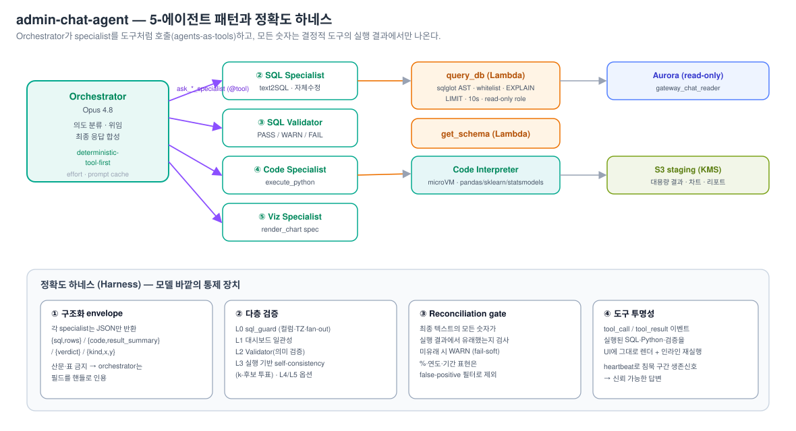
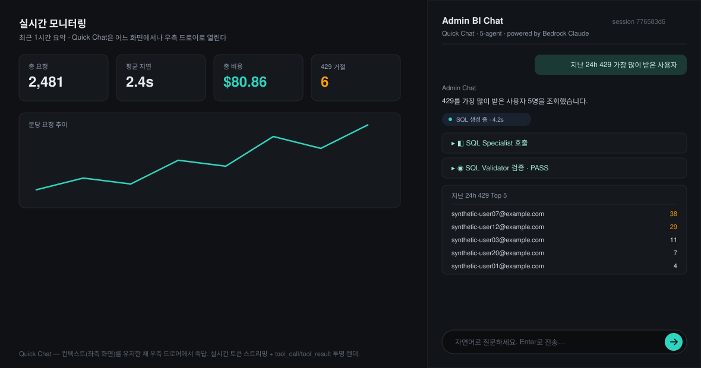
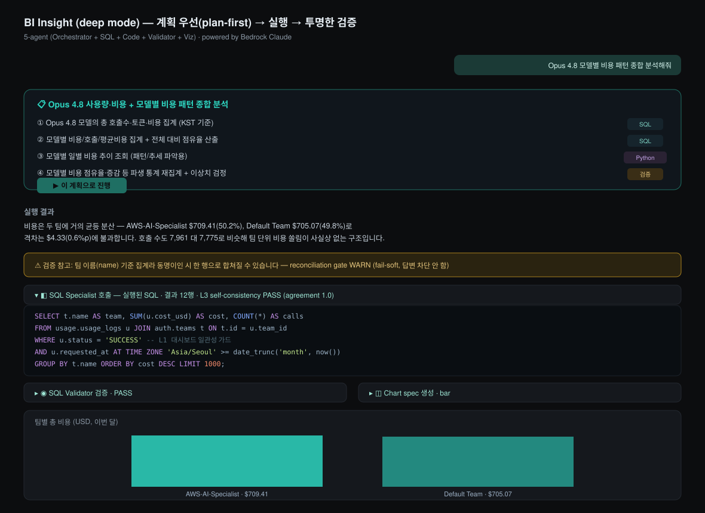

# 운영 데이터를 자연어로 묻는다: Bedrock AgentCore 위의 5-에이전트 BI 어시스턴트

> *"이번 달 사용자별 총 비용을 표와 차트로 보여줘." "예산 80%를 넘긴 팀이 어떤 모델에서 비용이 튀었지?" "지난 24시간 429를 가장 많이 받은 사용자는?"*

운영자가 던지는 질문은 미리 정의된 대시보드 지표를 늘 벗어납니다. 이런 *임의의 운영 질문*에 정확히 답하려면, 매번 SQL을 짜고 차트를 그릴 분석가가 붙어 있거나, 아니면 그 일을 대신 해 줄 무언가가 필요합니다. 우리는 후자를 택해, 자연어 질문을 검증된 SQL과 차트로 바꾸는 **AI BI 어시스턴트**를 만들었습니다. 5개의 전문 에이전트를 [Strands Agents](https://strandsagents.com/) 패턴으로 묶어 [Amazon Bedrock AgentCore Runtime](https://docs.aws.amazon.com/bedrock-agentcore/) 위에 호스팅한 시스템입니다.

그런데 LLM에게 "데이터를 분석해줘"라고 시키면, 그럴듯하지만 *틀린* 숫자를 자신 있게 만들어냅니다. 합계를 산문으로 어림하고, 퍼센트를 머릿속으로 계산하고, 없는 행을 지어냅니다. 운영 데이터에서 이런 환각은 단순한 오답으로 끝나지 않습니다. 그 분석을 근거로 누군가의 예산을 잘못 조이거나, 폭주하는 비용을 놓치게 됩니다. 그래서 이 글의 절반은 *어떻게 5개 에이전트가 협업하는가*이고, 나머지 절반은 *어떻게 그 답을 믿을 수 있게 만드는가*입니다. 후자를 위한 모델 바깥의 통제 장치 일체를 AWS [Deep Insight 시리즈](https://aws.amazon.com/ko/blogs/tech/harness-engineering-from-deep-insight/)는 **하네스(harness)**라고 부릅니다.

> **Disclaimer**: 본 글은 자사 PoC 구현을 정리한 것으로 특정 서드파티 제품을 권장하지 않습니다. 코드 인용은 구조 설명을 위해 단순화되었습니다. 일부 UI 도식은 다크 모드 기준으로 재구성한 것입니다.

---

## 1. 설계 원칙: deterministic-tool-first

우리 설계의 출발점은 기능이 아니라 *제약*이었습니다. 단 한 문장으로 요약됩니다.

> **답변과 차트의 모든 숫자는 (a) SQL 결과 셀 또는 (b) execute_python 출력에서만 나온다. Orchestrator는 산문에서 합·평균·비율·증감·순위를 직접 계산하지 않는다.**

이것이 "deterministic-tool-first" 원칙입니다. LLM은 *무엇을 물어볼지*(어떤 SQL을 짤지, 어떤 분석을 돌릴지)를 결정하는 데만 쓰고, *숫자 자체*는 항상 결정적 도구(SQL 엔진, Python 인터프리터)의 실행 결과에서 가져옵니다. 이 원칙을 강제하는 장치가 곧 하네스이고, 하네스는 세 기둥(결정적 도구 · 다층 검증 · 도구 투명성)으로 동작합니다.



---

## 2. 5-에이전트 아키텍처: agents-as-tools 패턴

Orchestrator(Opus 4.8)가 4개의 specialist를 `@tool` 데코레이터로 감싼 함수로 호출합니다. 각 specialist는 자신만의 system prompt와 도구를 가지며, Orchestrator는 그들을 마치 함수처럼 부릅니다. 이것이 Strands의 "agents-as-tools" 패턴입니다.

| 에이전트 | 모델(기본) | 역할 | 도구 |
|---|---|---|---|
| **① Orchestrator** | Opus 4.8 | 의도 분류 · 위임 · 최종 응답 합성 | `ask_*` 위임 도구 + `render_chart` |
| **② SQL Specialist** | Opus 4.8 (`MODEL_SQL`) | text-to-SQL 생성 + 자체수정 | `get_schema`, `query_db` |
| **③ SQL Validator** | Opus 4.8 | 의미 검증(AST 루브릭) → PASS/WARN/FAIL | (LLM 단독) |
| **④ Code Specialist** | Opus 4.8 (`MODEL_CODE`) | Python 분석(이상치·STL·SARIMAX·파생지표) | `execute_python` |
| **⑤ Viz Specialist** | Opus 4.8 (`MODEL_VIZ`) | 차트 종류·인코딩 결정 | (LLM 단독) |
| **Report Specialist** | `MODEL_CODE` | 다운로드용 리포트(PDF/PPTX/XLSX) | `get_schema`, `query_db`, `execute_python` |

모델 배정은 모두 환경변수로 개별 오버라이드할 수 있습니다(`MODEL_SQL`, `MODEL_CODE`, `MODEL_VIZ` 등). 미설정 시 모두 `MODEL_OPUS`(기본 `global.anthropic.claude-opus-4-8`)로 폴백합니다. 덕분에 "SQL 단계만 Sonnet으로 내려서 정확도가 유지되는지" 같은 A/B 실험을 *재빌드 없이* 수행할 수 있습니다. Deep Insight 블로그가 강조한 "환경변수 외부화로 재빌드 없는 운영 루프"와 같은 패턴입니다.

흐름을 구체적으로 보면, Orchestrator는 사용자의 질문 의도를 먼저 분류합니다. 단순 조회면 SQL Specialist에게 바로 위임하고, 추세·이상치 분석이 필요하면 SQL로 데이터를 뽑은 뒤 Code Specialist에게 넘기며, 결과를 보여줄 방식은 Viz Specialist가 결정합니다. 각 specialist의 산출물은 Orchestrator의 컨텍스트로 돌아오지만, 뒤에서 설명할 구조화 envelope 덕분에 *원본 데이터가 아니라 핸들*만 돌아옵니다. 이 구조가 컨텍스트 폭증을 막는 동시에, Orchestrator가 숫자를 직접 만지지 못하게 하는 1차 방어선이 됩니다.

---

## 3. 첫 번째 기둥, 결정적 도구: query_db의 6단계 방어

하네스의 첫 번째 기둥은 도구입니다. LLM이 만든 SQL을 그대로 실행해서는 안 됩니다. `query_db` Lambda는 6중 검증을 통과한 SQL만 *읽기 전용* 역할(`gateway_chat_reader`)로 실행합니다.

```python
# admin-chat-agent/lambdas/query_db/ — 검증 스택
# 1. sqlglot AST 파싱 (dialect='postgres')
# 2. 문장 타입       : SELECT/WITH만 허용 (DDL/DML 거부)
# 3. 테이블 화이트리스트 : schema_whitelist.yaml 에 등재된 테이블만
# 4. 금지 컬럼        : PII/자격증명 컬럼 차단
# 5. EXPLAIN 비용 한도 : EXPLAIN_COST_LIMIT (기본 50,000) 초과 시 거부
# 6. LIMIT 강제       : QUERY_LIMIT (기본 1,000) + statement_timeout 10초
```

이 6단계 위에서, `sql_guard.py`의 **L0/L1 결정적 정확도 가드**가 사람도 흔히 저지르는 분석 실수를 잡습니다. 예를 들어 `timestamptz` 컬럼을 `date_trunc`나 `::date`로 자를 때 `AT TIME ZONE 'Asia/Seoul'`이 없으면 9시간 오프셋 버그가 생기는데, 이를 WARN으로 표시합니다. 1:N JOIN에서 `SUM`/`AVG`를 서브쿼리 선집계 없이 쓰면 N배 중복 집계되는데, 이것도 잡습니다. `usage_logs` 합계에 `status='SUCCESS'` 필터가 빠져 대시보드 수치와 어긋나는 경우도 경고합니다. `errors`는 SQL Specialist에게 self-correction 피드백으로 돌아가고, `warnings`는 envelope의 `accuracy_warnings`로 흘러 Validator와 UI에 그대로 노출됩니다.

1,000행을 넘는 대용량 결과는 **S3 staging**(`staging/{session}/{step}.jsonl`, 1일 TTL)으로 빠지고, envelope에는 샘플 20행(`INLINE_ROWS`)과 *결정적 Python 통계*(min/max/mean/sum/share_pct)만 담깁니다. 컨텍스트 창에는 포인터만 두고 데이터는 파일에 두는 방식으로, Deep Insight의 [컨텍스트 엔지니어링](https://aws.amazon.com/ko/blogs/tech/context-engineering-from-deep-insight/)에서 말하는 "pointers in context, data in files" 패턴 그대로입니다.

분석용 Python은 또 다른 결정적 도구인 **AgentCore Code Interpreter** microVM 샌드박스에서 돌아갑니다(`execute_python`). pandas·statsmodels·matplotlib 등이 갖춰진 격리 환경이라, 이상치 탐지·STL 분해·SARIMAX 예측 같은 무거운 분석도 추론 엔진과 분리된 채 안전하게 실행됩니다. 이렇게 *추론(LLM)*과 *계산(코드 실행)*을 물리적으로 분리한 것이 deterministic-tool-first의 실체입니다.

---

## 4. 두 번째 기둥, 다층 검증: 3개의 정확도 층

하네스의 두 번째 기둥은 검증입니다. 세 개의 층이 겹겹이 작동합니다.

**첫째, 구조화 envelope.** 각 specialist는 Pydantic 스키마로 강제된 JSON만 반환합니다. SQL Specialist는 `{sql, rows, ...}`를, Code Specialist는 `{code, result_summary, ...}`를, Validator는 `{verdict, reason, ...}`를 돌려줍니다. 산문이나 마크다운 표는 금지이며, Orchestrator는 이 필드들을 *핸들*로만 인용합니다. "Orchestrator가 직접 계산하지 못하게" 만드는 구조적 강제입니다.

**둘째, 실행 기반 self-consistency(L3).** L0/L1(sql_guard)에서 L2(Validator 의미 검증)로 이어지며, 핵심은 **L3 실행 기반 self-consistency**입니다. SQL Specialist가 서로 다른 전략(direct, divide-and-conquer, query-plan 등)으로 k개의 SQL 후보를 생성하고, 각각을 *실제로 실행*한 뒤 결과셋을 정규화·해싱해 군집화합니다. 가장 큰 군집의 대표 SQL을 채택하고, 동률이거나 합의율(agreement)이 0.5 미만이면 WARN을 답니다.

```python
# admin-chat-agent/src/agent/candidate_select.py — 실행 결과 기반 투표 (요지)
clusters = group_by(normalize_and_hash(execute(c)) for c in candidates)
winner   = max(clusters, key=lambda c: (c.size, not c.has_warnings))
verdict  = "WARN" if tie or agreement < 0.5 else "PASS"
```

"LLM에게 이 SQL이 맞냐고 물어보는" 약한 검증을 넘어, *여러 방식으로 만든 SQL을 모두 돌려서 결과가 수렴하는지* 보는 강한 검증입니다. 후보 수는 모드에 따라 다른데, quick은 `K_QUICK=3`, deep은 `K_DEEP=5`입니다. 여기까지(L0~L3)는 quick·deep 양쪽에서 항상 동작합니다.

**선택적 추가 검증(L4·L5).** deep 모드에서는 여기에 두 가지를 *선택적으로* 더할 수 있습니다. 둘 다 기본은 OFF이고 `CRITIC_ENABLED`/`AUDITOR_ENABLED`로 켠 뒤 deep 모드의 고위험 질의에 한해서만 발동하며, 모두 fail-soft(차단하지 않고 경고만)로 동작합니다.

- **L4 cross-family critic**: *Claude와 다른 패밀리인 GPT-5.5*를 호출해 "이 SQL이 질문의 의도와 일치하는지"를 역번역 렌즈로 교차 검토합니다. 같은 모델 패밀리는 같은 사각지대를 공유하기 쉬우므로, *모델 다양성 자체를 검증 장치로* 쓰는 발상입니다. GPT-5.5는 Bedrock의 Responses API(us-east-2)로 호출합니다.

```python
# admin-chat-agent/src/agent/main.py — L4 cross-family critic (GPT-5.5 on Bedrock)
MODEL_CRITIC_ID = os.environ.get("MODEL_CRITIC_ID", "openai.gpt-5.5")
MANTLE_REGION   = os.environ.get("MANTLE_REGION", "us-east-2")   # GPT-5.5: 오하이오

from openai import BedrockOpenAI
from aws_bedrock_token_generator import provide_token
client = BedrockOpenAI(aws_region=MANTLE_REGION,
                       bedrock_token_provider=lambda: provide_token(region=MANTLE_REGION))
resp = client.responses.create(model=MODEL_CRITIC_ID, input=f"{system}\n\n{payload}")  # Responses API
```

- **L5 answer auditor**: 최종 산문에 등장한 숫자를 회의적으로 재검토하는 독립 감사자입니다.

quick 경로(드로어 즉답)에는 L4/L5가 전혀 개입하지 않습니다. 비용과 지연을 아끼려고 이렇게 좁게 거는 것입니다.

**셋째, reconciliation gate.** 마지막 안전망입니다. 최종 텍스트에 등장한 모든 숫자가 도구 실행 결과에서 유래했는지 Python으로 검사합니다. 유래하지 않은 숫자가 있으면 WARN을 띄우되 답을 막지는 않습니다(fail-soft). 단, 퍼센트·연도(1900~2100)·기간 표현("30일", "90 days") 같은 것은 false-positive 필터로 제외해, 정당한 표현까지 경고하지 않도록 했습니다.

---

## 5. 세 번째 기둥, 도구 투명성과 핸드오프

하네스의 세 번째 기둥은 투명성입니다. 에이전트가 실행한 SQL, 실행한 Python, 받은 검증 결과를 사용자가 *그대로 볼 수 있어야* 신뢰할 수 있습니다. 그래서 admin-chat-agent는 분석 과정을 `thinking`/`reasoning`/`heartbeat`/`tool_call`/`tool_result`/`text`/`chart`/`validator`/`plan`/`done` 같은 SSE 이벤트로 실시간 발행합니다.

긴 분석에는 침묵 구간이 생깁니다. sub-agent가 블로킹하는 20~60초 동안 화면이 멈춰 보이면 사용자는 불안해합니다. 그래서 `asyncio.Queue`로 두 태스크(orchestrator 스트림을 퍼 올리는 pump와 생존신호를 보내는 heartbeat)를 머지하고, 첫 텍스트가 나오면 heartbeat를 멈춥니다. heartbeat는 첫 틱을 2초 만에 빠르게 보내 "살아있음"을 알린 뒤 5초 간격으로 이어지며, 화면에는 "데이터 조회·SQL 생성 중", "Python 분석 실행 중" 같은 단계 라벨이 흐릅니다.

그리고 한 가지 더, **핸드오프**가 있습니다. admin-api는 AgentCore 소비를 *독립 백그라운드 태스크*로 분리하고, 클라이언트에 보내는 SSE 응답은 그 릴레이를 구독(tail)하는 것뿐입니다. 그래서 사용자가 22분짜리 심층 분석 도중 다른 메뉴로 이동해 SSE가 끊겨도, 분석은 끝까지 진행되어 DB에 저장되고, 복귀하면 `GET /stream`으로 재구독해 이어 볼 수 있습니다. 브라우저 새로고침에도 분석이 증발하지 않는 이유입니다.

---

## 6. 두 가지 경험: Quick Chat과 BI Insight

같은 5-에이전트 엔진을 두 가지 UX로 노출했습니다. 흥미로운 설계 결정 하나는, `if deep:` 같은 분기로 하나의 프롬프트를 갈래내지 않고 **별도의 Orchestrator 인스턴스 두 개**(시스템 프롬프트만 다름)를 둔 것입니다. 덕분에 quick 경로는 바이트 단위로 동일하게 유지되어 프롬프트 캐시가 안정적이고, 골든 테스트의 회귀가 0입니다.

**Quick Chat**은 어느 화면에서든 우하단 FAB(Floating Action Button)로 띄우는 분할 드로어입니다. 모니터링 화면을 보다가 *"지난 24h 429를 가장 많이 받은 사용자"*가 궁금하면, 화면을 떠나지 않고 즉석에서 묻습니다. 실시간 스트리밍으로 SQL Specialist 호출과 Validator 검증 과정이 카드로 펼쳐지고, 결과 표가 그 아래 렌더됩니다.



**BI Insight**(`/chat` 전체 페이지)는 다단계 심층 분석을 위한 공간입니다. deep 모드에서는 먼저 **계획 카드(PlanCard)**를 제시합니다. 각 단계에 SQL/Python/검증 태그가 붙어, 사용자가 "이 계획으로 진행"을 누르면 실행됩니다. 실행이 끝나면 답변, 그리고 그 답을 뒷받침하는 도구 호출 내역(실행된 SQL, Validator 결과, Chart spec)이 접힌 카드로, 마지막으로 차트가 렌더됩니다.



위 그림에서 주목할 부분은 노란색 WARN 배너입니다. reconciliation gate가 *"팀 이름 기준 집계라 동명이인이 있으면 한 행으로 합쳐질 수 있다"*는 한계를 fail-soft로 띄운 것입니다. 답을 막지는 않되 신뢰의 한계를 투명하게 드러냅니다. 그리고 펼쳐진 SQL 블록에는 `status = 'SUCCESS'` 필터(L1 가드)와 `AT TIME ZONE 'Asia/Seoul'`(L0 타임존 앵커)이 실제로 들어가 있습니다. §3의 가드가 추상적 규칙이 아니라 *생성된 SQL에 실제로 반영*된다는 증거입니다.

투명성의 정점은 **인라인 SQL 재실행**입니다. 분석가가 생성된 SQL을 펼쳐 직접 수정하고, LLM을 거치지 않고(0 토큰, 밀리초 단위) 다시 실행할 수 있습니다. admin-api가 동일한 `query_db` Lambda(같은 6단계 검증 스택)로 위임하고 세션 소유권을 확인하므로, 재실행도 안전합니다.

두 모드를 한 표로 비교하면 이렇습니다.

| 차원 | **Quick Chat** (드로어) | **BI Insight** (`/chat` 전체 페이지) |
|---|---|---|
| 모드 값 | `quick` (기본) | `deep` |
| Orchestrator | `orchestrator` / `orchestrator.md` | `orchestrator_deep` / `orchestrator_deep.md` |
| L3 후보 수 | `K_QUICK` = 3 | `K_DEEP` = 5 |
| L4 critic / L5 auditor | 비활성 | 활성(옵션) |
| Plan-first | 없음 (즉답) | 있음 (계획 승인 후 실행) |
| 진입점 | FAB → 드로어 (어느 화면에서나) | 좌측 메뉴 → 전체 페이지 |

---

## 7. 검증: 정확도 하네스의 효과

`admin-chat-agent/tests/`에는 12개 use-case 골든 테스트(SQL-only 8 + SQL+Code 4)가 있고, 배포된 에이전트를 실제로 호출해 생성 SQL·코드·verdict·차트·경로를 채점합니다. 하네스를 반복 개선하며 측정한 live pass-rate 추이는 다음과 같습니다.

| 단계 | pass rate | 주요 개선 |
|---|---|---|
| baseline | 17% | (schema drift / datetime 버그 / 권한 누락) |
| schema+datetime 정정 | 33% | few-shot·프롬프트 스키마 정정 + query_db datetime fix |
| CI권한+envelope+합성데이터 | 50% | Code Interpreter IAM + envelope-only + Tier B 데이터 |
| render_chart fix | **67%** | render_chart spec을 chart 이벤트로 발행 |

이 추이가 말하는 바는 분명합니다. **정확도 향상의 대부분이 모델 교체가 아니라 하네스(스키마 정합, envelope 강제, IAM 권한, 도구 계약)에서 나왔습니다.** 같은 모델이라도 주변 하네스를 어떻게 설계하느냐에 따라 17%와 67%를 오갑니다. 이것이 우리가 이 프로젝트에서 얻은 가장 큰 교훈입니다.

---

## 8. 정리

자연어로 운영 데이터를 묻는 BI 어시스턴트를 신뢰할 수 있게 만드는 일은, 더 똑똑한 모델을 고르는 문제가 아니라 *모델 바깥을 설계하는* 문제였습니다.

- **5-에이전트 분업**: Orchestrator가 의도를 분류하고 SQL·Code·Viz·Validator specialist에게 위임하는 agents-as-tools 구조로, 각자의 역할을 좁게 유지합니다.
- **결정적 도구**: 모든 숫자는 검증된 SQL(`query_db`, 6단계 + L0/L1 가드)이나 Code Interpreter 실행에서만 나옵니다. 추론과 계산을 물리적으로 분리합니다.
- **다층 검증**: 구조화 envelope → L0/L1 가드 → L2 Validator → L3 실행 기반 self-consistency → (옵션) L4 이종 모델 critic·L5 auditor → reconciliation gate.
- **도구 투명성**: 실행된 SQL·Python·검증 결과를 SSE로 그대로 노출하고, 인라인 재실행과 핸드오프(끊겨도 끝까지 완주)를 제공합니다.

LLM에게 분석을 맡길 때 진짜 어려운 부분은 모델을 부르는 일이 아니라, 그 답을 *믿을 수 있게* 만드는 일입니다. 하네스는 바로 그 일을 위한 설계였고, 골든 테스트가 17%에서 67%로 오른 궤적이 그 효과를 증명합니다.

---

## 참고 자료

**AWS 기술 블로그**
- [Deep Insight로 살펴보는 컨텍스트 엔지니어링](https://aws.amazon.com/ko/blogs/tech/context-engineering-from-deep-insight/)
- [Deep Insight로 살펴보는 하네스 엔지니어링](https://aws.amazon.com/ko/blogs/tech/harness-engineering-from-deep-insight/)

**Bedrock 위의 멀티 프로바이더 (본문 인용)**
- AWS News Blog (2026-06-01), *Get started with OpenAI GPT-5.5, GPT-5.4 models, and Codex on Amazon Bedrock*: https://aws.amazon.com/blogs/aws/get-started-with-openai-gpt-5-5-gpt-5-4-models-and-codex-on-amazon-bedrock/

**AWS 서비스 / SDK**
- [Amazon Bedrock](https://docs.aws.amazon.com/bedrock/) · [Bedrock AgentCore Runtime](https://docs.aws.amazon.com/bedrock-agentcore/) · [Strands Agents SDK](https://strandsagents.com/)
- [AWS Lambda](https://docs.aws.amazon.com/lambda/) · [Amazon S3](https://docs.aws.amazon.com/s3/) · [Amazon Aurora](https://docs.aws.amazon.com/aurora/)

---

*본 게시물의 코드 인용은 사내 `llm-gateway` 딜리버러블의 `admin-chat-agent`에서 발췌했으며 구조 설명을 위해 단순화되었습니다. 실제 구현의 정확한 동작은 해당 소스를 참조하시기 바랍니다.*
